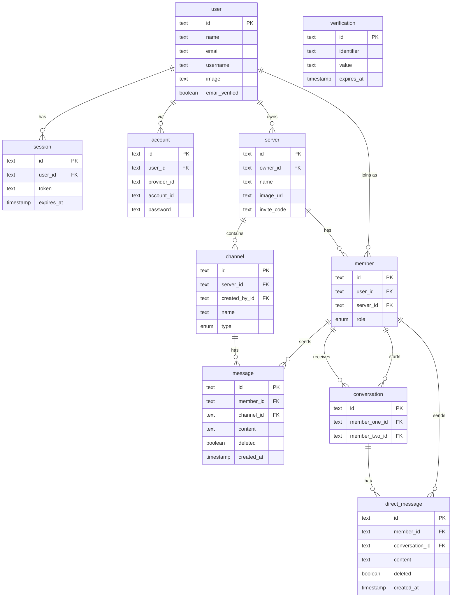

# Banana Space 🍌
Banana Space is a platform for all forms of realti mecommunication in one place. (Chat | Voice | Video)

I'd be easier just to take a look [here](https://bananaspace.vercel.app).


## Tech stack

- **React**
- **Next.js 16.2.6**
- **Tailwindcss**
- **Socket.io**
- **Drizzle**
- **NeonDB**
- **Shadcn/ui**
- **LiveKit**
- **Uploadthing**
- **BetterAuth**
 

### Key Features:

- Real-time messaging using Socket.io
- Send attachments as messages using UploadThing (images, pdfs)
- Delete & Edit messages in real time for all users
- Create Text, Audio and Video call Channels
- 1:1 conversation between members
- 1:1 video calls between members
- Member management (Kick, Role change Guest / Moderator)
- Unique invite link generation & full working invite system
- Infinite loading for messages in batches of 10 (tanstack/query)
- Server creation/customization
- UI using TailwindCSS and ShadcnUI
- Fully responsive UI
- Light / Dark mode
- Websocket fallback: Polling with alerts
- ORM using Drizzle
- Neon database 
- Authentication with BetterAuth


## ERD:


```
banana-space
├─ .next
│  ├─ BUILD_ID
│  ├─ app-path-routes-manifest.json
│  ├─ build
│  │  ├─ chunks
│  │  │  ├─ [root-of-the-server]__0d-m0h0._.js
│  │  │  ├─ [root-of-the-server]__0d-m0h0._.js.map
│  │  │  ├─ [root-of-the-server]__0iz~thn._.js
│  │  │  ├─ [root-of-the-server]__0iz~thn._.js.map
│  │  │  ├─ [root-of-the-server]__0ubbtyl._.js
│  │  │  ├─ [root-of-the-server]__0ubbtyl._.js.map
│  │  │  ├─ [root-of-the-server]__0z6~21d._.js
│  │  │  ├─ [root-of-the-server]__0z6~21d._.js.map
│  │  │  ├─ [turbopack-node]_transforms_postcss_ts_06e.r3r._.js
│  │  │  ├─ [turbopack-node]_transforms_postcss_ts_06e.r3r._.js.map
│  │  │  ├─ [turbopack-node]_transforms_webpack-loaders_ts_0z77ki4._.js
│  │  │  ├─ [turbopack-node]_transforms_webpack-loaders_ts_0z77ki4._.js.map
│  │  │  ├─ [turbopack]_runtime.js
│  │  │  └─ [turbopack]_runtime.js.map
│  │  ├─ package.json
│  │  ├─ postcss.js
│  │  ├─ postcss.js.map
│  │  ├─ webpack-loaders.js
│  │  └─ webpack-loaders.js.map
│  ├─ build-manifest.json
│  ├─ cache
│  │  ├─ .previewinfo
│  │  └─ .rscinfo
│  ├─ dev
│  │  ├─ build
│  │  │  ├─ chunks
│  │  │  │  ├─ [root-of-the-server]__0d-m0h0._.js
│  │  │  │  ├─ [root-of-the-server]__0d-m0h0._.js.map
│  │  │  │  ├─ [root-of-the-server]__0iz~thn._.js
│  │  │  │  ├─ [root-of-the-server]__0iz~thn._.js.map
│  │  │  │  ├─ [root-of-the-server]__0ubbtyl._.js
│  │  │  │  ├─ [root-of-the-server]__0ubbtyl._.js.map
│  │  │  │  ├─ [root-of-the-server]__0z6~21d._.js
│  │  │  │  ├─ [root-of-the-server]__0z6~21d._.js.map
│  │  │  │  ├─ [turbopack-node]_transforms_postcss_ts_06e.r3r._.js
│  │  │  │  ├─ [turbopack-node]_transforms_postcss_ts_06e.r3r._.js.map
│  │  │  │  ├─ [turbopack-node]_transforms_webpack-loaders_ts_0z77ki4._.js
│  │  │  │  ├─ [turbopack-node]_transforms_webpack-loaders_ts_0z77ki4._.js.map
│  │  │  │  ├─ [turbopack]_runtime.js
│  │  │  │  └─ [turbopack]_runtime.js.map
│  │  │  ├─ package.json
│  │  │  ├─ postcss.js
│  │  │  ├─ postcss.js.map
│  │  │  ├─ webpack-loaders.js
│  │  │  └─ webpack-loaders.js.map
│  │  ├─ build-manifest.json
│  │  ├─ cache
│  │  │  ├─ .rscinfo
│  │  │  ├─ images
│  │  │  │  ├─ _mF-0kr2mw1o_kJV3v7Ty7HLgevS52YRHuez_RHCEag
│  │  │  │  │  └─ 14400.1778953505133._Kg4Pxi8bhEO4hAjAKBO2HeujrXfBT20dJ0CZMEsvzA.Vy8iMjU1Mi0xOWUzMTA2MTdhYyI.webp
│  │  │  │  ├─ gr1rz_fYIqKO-EJD8hdNg6I-waqc6oznLOHjMADVvcM
│  │  │  │  │  └─ 14400.1778953489045.cnz_yM0CnffxJM8SiSLpi-ZWFQ6X8lriUk7BWEWbyqI.Vy8iMjU1Mi0xOWUzMTA2MTdhYyI.webp
│  │  │  │  ├─ v9WSwlz5Cd5QfoELCD0b_DHDrlxQam10SXK8UtNuopE
│  │  │  │  │  └─ 14400.1778953552464.zOXi3MHPMf4TgB2OPh9uJ7eaQuHRJzahbjBXn7u1zLE.Vy8iMjVmNzQtMTllMzEwOTFjYjIi.webp
│  │  │  │  └─ vE_QRjXthewH_K69N3djYYX795R-fr9E0Hynb4Fv5Bo
│  │  │  │     └─ 14400.1778953513399.lRiSIboV1-j-MWiMSxrcfd46AxifRS5cP59U7q5YcU4.Vy8iMjU1Mi0xOWUzMTA2MTdhYyI.webp
│  │  │  ├─ next-devtools-config.json
│  │  │  └─ turbopack
│  │  │     └─ ee6e79b1
│  │  │        ├─ 00000006.sst
│  │  │        ├─ 00000007.sst
│  │  │        ├─ 00000008.meta
│  │  │        ├─ 00000011.meta
│  │  │        ├─ 00000014.sst
│  │  │        ├─ 00000015.sst
│  │  │        ├─ 00000016.meta
│  │  │        ├─ 00000019.meta
│  │  │        ├─ 00000022.sst
│  │  │        ├─ 00000023.sst
│  │  │        ├─ 00000024.meta
│  │  │        ├─ 00000027.meta
│  │  │        ├─ 00000030.sst
│  │  │        ├─ 00000031.meta
│  │  │        ├─ 00000036.sst
│  │  │        ├─ 00000037.sst
│  │  │        ├─ 00000038.meta
│  │  │        ├─ 00000041.meta
│  │  │        ├─ 00000044.sst
│  │  │        ├─ 00000045.sst
│  │  │        ├─ 00000046.meta
│  │  │        ├─ 00000049.meta
│  │  │        ├─ 00000052.sst
│  │  │        ├─ 00000053.meta
│  │  │        ├─ 00000058.sst
│  │  │        ├─ 00000059.meta
│  │  │        ├─ 00000064.sst
│  │  │        ├─ 00000065.meta
│  │  │        ├─ 00000070.sst
│  │  │        ├─ 00000071.meta
│  │  │        ├─ 00000076.sst
│  │  │        ├─ 00000077.meta
│  │  │        ├─ 00000082.sst
│  │  │        ├─ 00000083.meta
│  │  │        ├─ 00000088.sst
│  │  │        ├─ 00000089.meta
│  │  │        ├─ 00000094.sst
│  │  │        ├─ 00000095.meta
│  │  │        ├─ 00000100.sst
│  │  │        ├─ 00000101.meta
│  │  │        ├─ 00000106.sst
│  │  │        ├─ 00000107.meta
│  │  │        ├─ 00000112.sst
│  │  │        ├─ 00000113.meta
│  │  │        ├─ 00000118.sst
│  │  │        ├─ 00000119.sst
│  │  │        ├─ 00000120.meta
│  │  │        ├─ 00000122.meta
│  │  │        ├─ 00000126.sst
│  │  │        ├─ 00000127.meta
│  │  │        ├─ 00000132.sst
│  │  │        ├─ 00000133.meta
│  │  │        ├─ 00000138.sst
│  │  │        ├─ 00000139.meta
│  │  │        ├─ 00000144.sst
│  │  │        ├─ 00000145.meta
│  │  │        ├─ 00000150.sst
│  │  │        ├─ 00000151.meta
│  │  │        ├─ 00000156.sst
│  │  │        ├─ 00000157.meta
│  │  │        ├─ 00000162.sst
│  │  │        ├─ 00000163.meta
│  │  │        ├─ 00000168.sst
│  │  │        ├─ 00000169.meta
│  │  │        ├─ 00000174.sst
│  │  │        ├─ 00000175.meta
│  │  │        ├─ 00000180.sst
│  │  │        ├─ 00000181.meta
│  │  │        ├─ 00000186.sst
│  │  │        ├─ 00000187.meta
│  │  │        ├─ 00000192.sst
│  │  │        ├─ 00000193.meta
│  │  │        ├─ 00000198.sst
│  │  │        ├─ 00000199.meta
│  │  │        ├─ 00000204.sst
│  │  │        ├─ 00000205.meta
│  │  │        ├─ 00000210.sst
│  │  │        ├─ 00000211.meta
│  │  │        ├─ 00000216.sst
│  │  │        ├─ 00000217.meta
│  │  │        ├─ 00000222.sst
│  │  │        ├─ 00000223.meta
│  │  │        ├─ 00000228.sst
│  │  │        ├─ 00000229.meta
│  │  │        ├─ 00000234.sst
│  │  │        ├─ 00000235.meta
│  │  │        ├─ 00000240.sst
│  │  │        ├─ 00000241.meta
│  │  │        ├─ 00000246.sst
│  │  │        ├─ 00000247.meta
│  │  │        ├─ 00000252.sst
│  │  │        ├─ 00000253.meta
│  │  │        ├─ 00000258.sst
│  │  │        ├─ 00000259.meta
│  │  │        ├─ 00000264.sst
│  │  │        ├─ 00000265.meta
│  │  │        ├─ 00000270.sst
│  │  │        ├─ 00000271.meta
│  │  │        ├─ 00000276.sst
│  │  │        ├─ 00000277.meta
│  │  │        ├─ 00000282.sst
│  │  │        ├─ 00000283.meta
│  │  │        ├─ 00000288.sst
│  │  │        ├─ 00000289.meta
│  │  │        ├─ 00000294.sst
│  │  │        ├─ 00000295.meta
│  │  │        ├─ 00000300.sst
│  │  │        ├─ 00000301.meta
│  │  │        ├─ 00000306.sst
│  │  │        ├─ 00000307.meta
│  │  │        ├─ 00000312.sst
│  │  │        ├─ 00000313.meta
│  │  │        ├─ 00000318.sst
│  │  │        ├─ 00000319.meta
│  │  │        ├─ 00000324.sst
│  │  │        ├─ 00000325.meta
│  │  │        ├─ 00000330.sst
│  │  │        ├─ 00000331.meta
│  │  │        ├─ 00000336.sst
│  │  │        ├─ 00000337.meta
│  │  │        ├─ 00000342.sst
│  │  │        ├─ 00000343.meta
│  │  │        ├─ 00000348.sst
│  │  │        ├─ 00000349.meta
│  │  │        ├─ 00000354.sst
│  │  │        ├─ 00000355.meta
│  │  │        ├─ 00000360.sst
│  │  │        ├─ 00000361.meta
│  │  │        ├─ 00000366.sst
│  │  │        ├─ 00000367.meta
│  │  │        ├─ 00000372.sst
│  │  │        ├─ 00000373.meta
│  │  │        ├─ 00000378.sst
│  │  │        ├─ 00000379.meta
│  │  │        ├─ 00000384.sst
│  │  │        ├─ 00000385.meta
│  │  │        ├─ 00000390.sst
│  │  │        ├─ 00000391.meta
│  │  │        ├─ 00000396.sst
│  │  │        ├─ 00000397.meta
│  │  │        ├─ 00000402.sst
│  │  │        ├─ 00000403.meta
│  │  │        ├─ 00000408.sst
│  │  │        ├─ 00000409.meta
│  │  │        ├─ 00000414.sst
│  │  │        ├─ 00000415.meta
│  │  │        ├─ 00000420.sst
│  │  │        ├─ 00000421.meta
│  │  │        ├─ 00000426.sst
│  │  │        ├─ 00000427.meta
│  │  │        ├─ 00000432.sst
│  │  │        ├─ 00000433.meta
│  │  │        ├─ 00000438.sst
│  │  │        ├─ 00000439.meta
│  │  │        ├─ 00000444.sst
│  │  │        ├─ 00000445.meta
│  │  │        ├─ 00000450.sst
│  │  │        ├─ 00000451.meta
│  │  │        ├─ 00000456.sst
│  │  │        ├─ 00000457.meta
│  │  │        ├─ 00000462.sst
│  │  │        ├─ 00000463.meta
│  │  │        ├─ 00000468.sst
│  │  │        ├─ 00000469.meta
│  │  │        ├─ 00000474.sst
│  │  │        ├─ 00000475.meta
│  │  │        ├─ 00000480.sst
│  │  │        ├─ 00000481.meta
│  │  │        ├─ 00000486.sst
│  │  │        ├─ 00000487.meta
│  │  │        ├─ 00000492.sst
│  │  │        ├─ 00000493.meta
│  │  │        ├─ 00000498.sst
│  │  │        ├─ 00000499.meta
│  │  │        ├─ 00000504.sst
│  │  │        ├─ 00000505.meta
│  │  │        ├─ 00000510.sst
│  │  │        ├─ 00000511.meta
│  │  │        ├─ 00000516.sst
│  │  │        ├─ 00000517.meta
│  │  │        ├─ 00000522.sst
│  │  │        ├─ 00000523.meta
│  │  │        ├─ 00000528.sst
│  │  │        ├─ 00000529.meta
│  │  │        ├─ 00000534.sst
│  │  │        ├─ 00000535.meta
│  │  │        ├─ 00000540.sst
│  │  │        ├─ 00000541.meta
│  │  │        ├─ 00000546.sst
│  │  │        ├─ 00000547.meta
│  │  │        ├─ 00000552.sst
│  │  │        ├─ 00000553.meta
│  │  │        ├─ 00000558.sst
│  │  │        ├─ 00000559.meta
│  │  │        ├─ 00000564.sst
│  │  │        ├─ 00000565.meta
│  │  │        ├─ 00000570.sst
│  │  │        ├─ 00000571.meta
│  │  │        ├─ 00000576.sst
│  │  │        ├─ 00000577.meta
│  │  │        ├─ 00000582.sst
│  │  │        ├─ 00000583.meta
│  │  │        ├─ 00000588.sst
│  │  │        ├─ 00000589.meta
│  │  │        ├─ 00000594.sst
│  │  │        ├─ 00000595.meta
│  │  │        ├─ 00000600.sst
│  │  │        ├─ 00000601.meta
│  │  │        ├─ 00000606.sst
│  │  │        ├─ 00000607.meta
│  │  │        ├─ 00000612.sst
│  │  │        ├─ 00000613.meta
│  │  │        ├─ 00000618.sst
│  │  │        ├─ 00000619.meta
│  │  │        ├─ 00000624.sst
│  │  │        ├─ 00000625.meta
│  │  │        ├─ 00000630.sst
│  │  │        ├─ 00000631.meta
│  │  │        ├─ 00000636.sst
│  │  │        ├─ 00000637.meta
│  │  │        ├─ 00000642.sst
│  │  │        ├─ 00000643.meta
│  │  │        ├─ 00000648.sst
│  │  │        ├─ 00000649.meta
│  │  │        ├─ 00000654.sst
│  │  │        ├─ 00000655.meta
│  │  │        ├─ 00000660.sst
│  │  │        ├─ 00000661.meta
│  │  │        ├─ 00000666.sst
│  │  │        ├─ 00000667.meta
│  │  │        ├─ 00000672.sst
│  │  │        ├─ 00000673.meta
│  │  │        ├─ 00000678.sst
│  │  │        ├─ 00000679.meta
│  │  │        ├─ 00000684.sst
│  │  │        ├─ 00000685.meta
│  │  │        ├─ 00000690.sst
│  │  │        ├─ 00000691.meta
│  │  │        ├─ 00000696.sst
│  │  │        ├─ 00000697.meta
│  │  │        ├─ 00000702.sst
│  │  │        ├─ 00000703.meta
│  │  │        ├─ 00000708.sst
│  │  │        ├─ 00000709.sst
│  │  │        ├─ 00000710.meta
│  │  │        ├─ 00000713.meta
│  │  │        ├─ 00000716.sst
│  │  │        ├─ 00000717.meta
│  │  │        ├─ 00000722.sst
│  │  │        ├─ 00000723.meta
│  │  │        ├─ 00000728.sst
│  │  │        ├─ 00000729.meta
│  │  │        ├─ 00000734.sst
│  │  │        ├─ 00000735.meta
│  │  │        ├─ 00000740.sst
│  │  │        ├─ 00000741.meta
│  │  │        ├─ 00000746.sst
│  │  │        ├─ 00000747.meta
│  │  │        ├─ 00000752.sst
│  │  │        ├─ 00000753.meta
│  │  │        ├─ 00000758.sst
│  │  │        ├─ 00000759.meta
│  │  │        ├─ 00000764.sst
│  │  │        ├─ 00000765.meta
│  │  │        ├─ 00000770.sst
│  │  │        ├─ 00000771.meta
│  │  │        ├─ 00000776.sst
│  │  │        ├─ 00000777.meta
│  │  │        ├─ 00000782.sst
│  │  │        ├─ 00000783.meta
│  │  │        ├─ 00000788.sst
│  │  │        ├─ 00000789.meta
│  │  │        ├─ 00000794.sst
│  │  │        ├─ 00000795.meta
│  │  │        ├─ 00000800.sst
│  │  │        ├─ 00000801.meta
│  │  │        ├─ 00000806.sst
│  │  │        ├─ 00000807.meta
│  │  │        ├─ 00000812.sst
│  │  │        ├─ 00000813.meta
│  │  │        ├─ 00000818.sst
│  │  │        ├─ 00000819.meta
│  │  │        ├─ 00000824.sst
│  │  │        ├─ 00000825.meta
│  │  │        ├─ 00000830.sst
│  │  │        ├─ 00000831.meta
│  │  │        ├─ 00000836.sst
│  │  │        ├─ 00000837.meta
│  │  │        ├─ 00000842.sst
│  │  │        ├─ 00000843.meta
│  │  │        ├─ 00000848.sst
│  │  │        ├─ 00000849.meta
│  │  │        ├─ 00000854.sst
│  │  │        ├─ 00000855.meta
│  │  │        ├─ 00000860.sst
│  │  │        ├─ 00000861.meta
│  │  │        ├─ 00000866.sst
│  │  │        ├─ 00000867.meta
│  │  │        ├─ 00000872.sst
│  │  │        ├─ 00000873.meta
│  │  │        ├─ 00000878.sst
│  │  │        ├─ 00000879.meta
│  │  │        ├─ 00000884.sst
│  │  │        ├─ 00000885.sst
│  │  │        ├─ 00000886.meta
│  │  │        ├─ 00000889.meta
│  │  │        ├─ 00000892.sst
│  │  │        ├─ 00000893.sst
│  │  │        ├─ 00000894.meta
│  │  │        ├─ 00000897.meta
│  │  │        ├─ 00000903.sst
│  │  │        ├─ 00000904.sst
│  │  │        ├─ 00000905.meta
│  │  │        ├─ 00000906.meta
│  │  │        ├─ 00000915.sst
│  │  │        ├─ 00000916.sst
│  │  │        ├─ 00000917.meta
│  │  │        ├─ 00000919.meta
│  │  │        ├─ 00000923.sst
│  │  │        ├─ 00000924.sst
│  │  │        ├─ 00000925.meta
│  │  │        ├─ 00000926.meta
│  │  │        ├─ 00000931.sst
│  │  │        ├─ 00000932.meta
│  │  │        ├─ 00000937.sst
│  │  │        ├─ 00000938.meta
│  │  │        ├─ 00000943.sst
│  │  │        ├─ 00000944.meta
│  │  │        ├─ 00000949.sst
│  │  │        ├─ 00000950.meta
│  │  │        ├─ 00000955.sst
│  │  │        ├─ 00000956.meta
│  │  │        ├─ 00000961.sst
│  │  │        ├─ 00000962.meta
│  │  │        ├─ 00000967.sst
│  │  │        ├─ 00000968.meta
│  │  │        ├─ 00000973.sst
│  │  │        ├─ 00000974.meta
│  │  │        ├─ 00000979.sst
│  │  │        ├─ 00000980.sst
│  │  │        ├─ 00000981.meta
│  │  │        ├─ 00000983.meta
│  │  │        ├─ 00000987.sst
│  │  │        ├─ 00000988.meta
│  │  │        ├─ 00000993.sst
│  │  │        ├─ 00000994.meta
│  │  │        ├─ 00000999.sst
│  │  │        ├─ 00001000.meta
│  │  │        ├─ 00001005.sst
│  │  │        ├─ 00001006.sst
│  │  │        ├─ 00001007.meta
│  │  │        ├─ 00001010.meta
│  │  │        ├─ 00001013.sst
│  │  │        ├─ 00001014.meta
│  │  │        ├─ 00001019.sst
│  │  │        ├─ 00001020.meta
│  │  │        ├─ 00001025.sst
│  │  │        ├─ 00001026.sst
│  │  │        ├─ 00001027.meta
│  │  │        ├─ 00001030.meta
│  │  │        ├─ 00001033.sst
│  │  │        ├─ 00001034.meta
│  │  │        ├─ 00001039.sst
│  │  │        ├─ 00001040.sst
│  │  │        ├─ 00001041.meta
│  │  │        ├─ 00001044.meta
│  │  │        ├─ 00001047.sst
│  │  │        ├─ 00001048.meta
│  │  │        ├─ 00001053.sst
│  │  │        ├─ 00001054.meta
│  │  │        ├─ 00001059.sst
│  │  │        ├─ 00001060.meta
│  │  │        ├─ 00001065.sst
│  │  │        ├─ 00001066.meta
│  │  │        ├─ 00001071.sst
│  │  │        ├─ 00001072.sst
│  │  │        ├─ 00001073.meta
│  │  │        ├─ 00001074.meta
│  │  │        ├─ 00001079.sst
│  │  │        ├─ 00001080.sst
│  │  │        ├─ 00001081.meta
│  │  │        ├─ 00001082.meta
│  │  │        ├─ 00001087.sst
│  │  │        ├─ 00001088.meta
│  │  │        ├─ 00001093.sst
│  │  │        ├─ 00001094.sst
│  │  │        ├─ 00001095.meta
│  │  │        ├─ 00001098.meta
│  │  │        ├─ 00001101.sst
│  │  │        ├─ 00001102.meta
│  │  │        ├─ 00001107.sst
│  │  │        ├─ 00001108.sst
│  │  │        ├─ 00001109.meta
│  │  │        ├─ 00001112.meta
│  │  │        ├─ 00001115.sst
│  │  │        ├─ 00001116.sst
│  │  │        ├─ 00001117.meta
│  │  │        ├─ 00001120.meta
│  │  │        ├─ 00001123.sst
│  │  │        ├─ 00001124.sst
│  │  │        ├─ 00001125.meta
│  │  │        ├─ 00001128.meta
│  │  │        ├─ 00001131.sst
│  │  │        ├─ 00001132.meta
│  │  │        ├─ 00001137.sst
│  │  │        ├─ 00001138.meta
│  │  │        ├─ 00001143.sst
│  │  │        ├─ 00001144.meta
│  │  │        ├─ 00001149.sst
│  │  │        ├─ 00001150.meta
│  │  │        ├─ 00001155.sst
│  │  │        ├─ 00001156.meta
│  │  │        ├─ 00001161.sst
│  │  │        ├─ 00001162.meta
│  │  │        ├─ 00001167.sst
│  │  │        ├─ 00001168.meta
│  │  │        ├─ 00001173.sst
│  │  │        ├─ 00001174.meta
│  │  │        ├─ 00001179.sst
│  │  │        ├─ 00001180.meta
│  │  │        ├─ 00001185.sst
│  │  │        ├─ 00001186.meta
│  │  │        ├─ 00001191.sst
│  │  │        ├─ 00001192.meta
│  │  │        ├─ 00001197.sst
│  │  │        ├─ 00001198.meta
│  │  │        ├─ 00001203.sst
│  │  │        ├─ 00001204.meta
│  │  │        ├─ 00001209.sst
│  │  │        ├─ 00001210.meta
│  │  │        ├─ 00001215.sst
│  │  │        ├─ 00001216.meta
│  │  │        ├─ 00001221.sst
│  │  │        ├─ 00001222.meta
│  │  │        ├─ 00001227.sst
│  │  │        ├─ 00001228.meta
│  │  │        ├─ 00001233.sst
│  │  │        ├─ 00001234.meta
│  │  │        ├─ 00001239.sst
│  │  │        ├─ 00001240.sst
│  │  │        ├─ 00001241.meta
│  │  │        ├─ 00001244.meta
│  │  │        ├─ 00001247.sst
│  │  │        ├─ 00001248.meta
│  │  │        ├─ 00001253.sst
│  │  │        ├─ 00001254.meta
│  │  │        ├─ 00001259.sst
│  │  │        ├─ 00001260.meta
│  │  │        ├─ 00001265.sst
│  │  │        ├─ 00001266.meta
│  │  │        ├─ 00001271.sst
│  │  │        ├─ 00001272.meta
│  │  │        ├─ 00001277.sst
│  │  │        ├─ 00001278.meta
│  │  │        ├─ 00001283.sst
│  │  │        ├─ 00001284.meta
│  │  │        ├─ 00001289.sst
│  │  │        ├─ 00001290.meta
│  │  │        ├─ 00001295.sst
│  │  │        ├─ 00001296.meta
│  │  │        ├─ 00001301.sst
│  │  │        ├─ 00001302.meta
│  │  │        ├─ 00001307.sst
│  │  │        ├─ 00001308.meta
│  │  │        ├─ 00001313.sst
│  │  │        ├─ 00001314.meta
│  │  │        ├─ 00001319.sst
│  │  │        ├─ 00001320.meta
│  │  │        ├─ 00001325.sst
│  │  │        ├─ 00001326.meta
│  │  │        ├─ 00001331.sst
│  │  │        ├─ 00001332.meta
│  │  │        ├─ 00001337.sst
│  │  │        ├─ 00001338.meta
│  │  │        ├─ 00001343.sst
│  │  │        ├─ 00001344.meta
│  │  │        ├─ 00001349.sst
│  │  │        ├─ 00001350.meta
│  │  │        ├─ 00001355.sst
│  │  │        ├─ 00001356.meta
│  │  │        ├─ 00001361.sst
│  │  │        ├─ 00001362.meta
│  │  │        ├─ 00001367.sst
│  │  │        ├─ 00001368.meta
│  │  │        ├─ 00001373.sst
│  │  │        ├─ 00001374.meta
│  │  │        ├─ 00001379.sst
│  │  │        ├─ 00001380.meta
│  │  │        ├─ 00001385.sst
│  │  │        ├─ 00001386.sst
│  │  │        ├─ 00001387.meta
│  │  │        ├─ 00001388.meta
│  │  │        ├─ 00001393.sst
│  │  │        ├─ 00001394.sst
│  │  │        ├─ 00001395.meta
│  │  │        ├─ 00001398.meta
│  │  │        ├─ 00001401.sst
│  │  │        ├─ 00001402.meta
│  │  │        ├─ 00001407.sst
│  │  │        ├─ 00001408.meta
│  │  │        ├─ 00001413.sst
│  │  │        ├─ 00001414.sst
│  │  │        ├─ 00001415.meta
│  │  │        ├─ 00001418.meta
│  │  │        ├─ 00001421.sst
│  │  │        ├─ 00001422.meta
│  │  │        ├─ 00001427.sst
│  │  │        ├─ 00001428.meta
│  │  │        ├─ 00001433.sst
│  │  │        ├─ 00001434.meta
│  │  │        ├─ 00001439.sst
│  │  │        ├─ 00001440.meta
│  │  │        ├─ 00001445.sst
│  │  │        ├─ 00001446.sst
│  │  │        ├─ 00001447.meta
│  │  │        ├─ 00001449.meta
│  │  │        ├─ 00001453.sst
│  │  │        ├─ 00001454.sst
│  │  │        ├─ 00001455.meta
│  │  │        ├─ 00001458.meta
│  │  │        ├─ 00001461.sst
│  │  │        ├─ 00001462.meta
│  │  │        ├─ 00001467.sst
│  │  │        ├─ 00001468.meta
│  │  │        ├─ 00001473.sst
│  │  │        ├─ 00001474.meta
│  │  │        ├─ 00001479.sst
│  │  │        ├─ 00001480.meta
│  │  │        ├─ 00001485.sst
│  │  │        ├─ 00001486.meta
│  │  │        ├─ 00001491.sst
│  │  │        ├─ 00001492.meta
│  │  │        ├─ 00001497.sst
│  │  │        ├─ 00001498.meta
│  │  │        ├─ 00001503.sst
│  │  │        ├─ 00001504.meta
│  │  │        ├─ 00001509.sst
│  │  │        ├─ 00001510.meta
│  │  │        ├─ 00001515.sst
│  │  │        ├─ 00001516.meta
│  │  │        ├─ 00001521.sst
│  │  │        ├─ 00001522.meta
│  │  │        ├─ 00001527.sst
│  │  │        ├─ 00001528.meta
│  │  │        ├─ 00001533.sst
│  │  │        ├─ 00001534.meta
│  │  │        ├─ 00001539.sst
│  │  │        ├─ 00001540.meta
│  │  │        ├─ 00001545.sst
│  │  │        ├─ 00001546.meta
│  │  │        ├─ 00001551.sst
│  │  │        ├─ 00001552.sst
│  │  │        ├─ 00001553.meta
│  │  │        ├─ 00001554.meta
│  │  │        ├─ 00001562.sst
│  │  │        ├─ 00001563.sst
│  │  │        ├─ 00001564.meta
│  │  │        ├─ 00001565.meta
│  │  │        ├─ 00001570.sst
│  │  │        ├─ 00001571.sst
│  │  │        ├─ 00001572.meta
│  │  │        ├─ 00001575.meta
│  │  │        ├─ 00001578.sst
│  │  │        ├─ 00001579.sst
│  │  │        ├─ 00001580.meta
│  │  │        ├─ 00001581.meta
│  │  │        ├─ 00001586.sst
│  │  │        ├─ 00001587.sst
│  │  │        ├─ 00001588.meta
│  │  │        ├─ 00001591.meta
│  │  │        ├─ 00001594.sst
│  │  │        ├─ 00001595.meta
│  │  │        ├─ 00001603.sst
│  │  │        ├─ 00001604.sst
│  │  │        ├─ 00001605.meta
│  │  │        ├─ 00001606.meta
│  │  │        ├─ 00001619.sst
│  │  │        ├─ 00001620.sst
│  │  │        ├─ 00001621.meta
│  │  │        ├─ 00001624.meta
│  │  │        ├─ 00001627.sst
│  │  │        ├─ 00001628.meta
│  │  │        ├─ 00001633.sst
│  │  │        ├─ 00001634.meta
│  │  │        ├─ 00001639.sst
│  │  │        ├─ 00001640.meta
│  │  │        ├─ 00001645.sst
│  │  │        ├─ 00001646.meta
│  │  │        ├─ 00001651.sst
│  │  │        ├─ 00001652.meta
│  │  │        ├─ 00001657.sst
│  │  │        ├─ 00001658.meta
│  │  │        ├─ 00001663.sst
│  │  │        ├─ 00001664.meta
│  │  │        ├─ 00001672.sst
│  │  │        ├─ 00001673.sst
│  │  │        ├─ 00001674.meta
│  │  │        ├─ 00001675.meta
│  │  │        ├─ 00001680.sst
│  │  │        ├─ 00001681.sst
│  │  │        ├─ 00001682.meta
│  │  │        ├─ 00001683.meta
│  │  │        ├─ 00001698.sst
│  │  │        ├─ 00001699.sst
│  │  │        ├─ 00001700.meta
│  │  │        ├─ 00001701.meta
│  │  │        ├─ 00001706.sst
│  │  │        ├─ 00001707.sst
│  │  │        ├─ 00001708.meta
│  │  │        ├─ 00001711.meta
│  │  │        ├─ 00001714.sst
│  │  │        ├─ 00001715.meta
│  │  │        ├─ 00001720.sst
│  │  │        ├─ 00001721.meta
│  │  │        ├─ 00001726.sst
│  │  │        ├─ 00001727.meta
│  │  │        ├─ 00001732.sst
│  │  │        ├─ 00001733.sst
│  │  │        ├─ 00001734.meta
│  │  │        ├─ 00001737.meta
│  │  │        ├─ 00001740.sst
│  │  │        ├─ 00001741.sst
│  │  │        ├─ 00001742.meta
│  │  │        ├─ 00001744.meta
│  │  │        ├─ 00001748.sst
│  │  │        ├─ 00001749.sst
│  │  │        ├─ 00001750.meta
│  │  │        ├─ 00001753.meta
│  │  │        ├─ 00001756.sst
│  │  │        ├─ 00001757.meta
│  │  │        ├─ 00001762.sst
│  │  │        ├─ 00001763.meta
│  │  │        ├─ 00001768.sst
│  │  │        ├─ 00001769.meta
│  │  │        ├─ 00001774.sst
│  │  │        ├─ 00001775.meta
│  │  │        ├─ 00001780.sst
│  │  │        ├─ 00001781.meta
│  │  │        ├─ 00001786.sst
│  │  │        ├─ 00001787.meta
│  │  │        ├─ 00001792.sst
│  │  │        ├─ 00001793.meta
│  │  │        ├─ 00001798.sst
│  │  │        ├─ 00001799.meta
│  │  │        ├─ 00001804.sst
│  │  │        ├─ 00001805.meta
│  │  │        ├─ 00001810.sst
│  │  │        ├─ 00001811.meta
│  │  │        ├─ 00001816.sst
│  │  │        ├─ 00001817.meta
│  │  │        ├─ 00001822.sst
│  │  │        ├─ 00001823.sst
│  │  │        ├─ 00001824.meta
│  │  │        ├─ 00001827.meta
│  │  │        ├─ 00001830.sst
│  │  │        ├─ 00001831.meta
│  │  │        ├─ 00001836.sst
│  │  │        ├─ 00001837.meta
│  │  │        ├─ 00001842.sst
│  │  │        ├─ 00001843.meta
│  │  │        ├─ 00001848.sst
│  │  │        ├─ 00001849.meta
│  │  │        ├─ 00001854.sst
│  │  │        ├─ 00001855.meta
│  │  │        ├─ 00001860.sst
│  │  │        ├─ 00001861.meta
│  │  │        ├─ 00001866.sst
│  │  │        ├─ 00001867.meta
│  │  │        ├─ 00001872.sst
│  │  │        ├─ 00001873.sst
│  │  │        ├─ 00001874.meta
│  │  │        ├─ 00001875.meta
│  │  │        ├─ 00001880.sst
│  │  │        ├─ 00001881.sst
│  │  │        ├─ 00001882.meta
│  │  │        ├─ 00001885.meta
│  │  │        ├─ 00001888.sst
│  │  │        ├─ 00001889.meta
│  │  │        ├─ 00001897.sst
│  │  │        ├─ 00001898.sst
│  │  │        ├─ 00001899.meta
│  │  │        ├─ 00001900.meta
│  │  │        ├─ 00001905.sst
│  │  │        ├─ 00001906.meta
│  │  │        ├─ 00001914.sst
│  │  │        ├─ 00001915.sst
│  │  │        ├─ 00001916.meta
│  │  │        ├─ 00001917.meta
│  │  │        ├─ 00001929.sst
│  │  │        ├─ 00001930.sst
│  │  │        ├─ 00001931.meta
│  │  │        ├─ 00001932.meta
│  │  │        ├─ 00001940.sst
│  │  │        ├─ 00001941.sst
│  │  │        ├─ 00001942.meta
│  │  │        ├─ 00001944.meta
│  │  │        ├─ 00001952.sst
│  │  │        ├─ 00001953.sst
│  │  │        ├─ 00001954.meta
│  │  │        ├─ 00001956.meta
│  │  │        ├─ 00001960.sst
│  │  │        ├─ 00001961.meta
│  │  │        ├─ 00001966.sst
│  │  │        ├─ 00001967.meta
│  │  │        ├─ 00001972.sst
│  │  │        ├─ 00001973.meta
│  │  │        ├─ 00001978.sst
│  │  │        ├─ 00001979.meta
│  │  │        ├─ 00001984.sst
│  │  │        ├─ 00001985.meta
│  │  │        ├─ 00001990.sst
│  │  │        ├─ 00001991.meta
│  │  │        ├─ 00001996.sst
│  │  │        ├─ 00001997.meta
│  │  │        ├─ 00002002.sst
│  │  │        ├─ 00002003.meta
│  │  │        ├─ 00002008.sst
│  │  │        ├─ 00002009.meta
│  │  │        ├─ 00002014.sst
│  │  │        ├─ 00002015.sst
│  │  │        ├─ 00002016.meta
│  │  │        ├─ 00002019.meta
│  │  │        ├─ 00002022.sst
│  │  │        ├─ 00002023.meta
│  │  │        ├─ 00002028.sst
│  │  │        ├─ 00002029.meta
│  │  │        ├─ 00002034.sst
│  │  │        ├─ 00002035.meta
│  │  │        ├─ 00002040.sst
│  │  │        ├─ 00002041.sst
│  │  │        ├─ 00002042.meta
│  │  │        ├─ 00002045.meta
│  │  │        ├─ 00002048.sst
│  │  │        ├─ 00002049.meta
│  │  │        ├─ 00002054.sst
│  │  │        ├─ 00002055.meta
│  │  │        ├─ 00002060.sst
│  │  │        ├─ 00002061.meta
│  │  │        ├─ 00002066.sst
│  │  │        ├─ 00002067.meta
│  │  │        ├─ 00002072.sst
│  │  │        ├─ 00002073.meta
│  │  │        ├─ 00002078.sst
│  │  │        ├─ 00002079.sst
│  │  │        ├─ 00002080.meta
│  │  │        ├─ 00002081.meta
│  │  │        ├─ 00002086.sst
│  │  │        ├─ 00002087.sst
│  │  │        ├─ 00002088.meta
│  │  │        ├─ 00002091.meta
│  │  │        ├─ 00002094.sst
│  │  │        ├─ 00002095.meta
│  │  │        ├─ 00002100.sst
│  │  │        ├─ 00002101.meta
│  │  │        ├─ 00002106.sst
│  │  │        ├─ 00002107.meta
│  │  │        ├─ 00002112.sst
│  │  │        ├─ 00002113.sst
│  │  │        ├─ 00002114.meta
│  │  │        ├─ 00002115.meta
│  │  │        ├─ 00002120.sst
│  │  │        ├─ 00002121.sst
│  │  │        ├─ 00002122.meta
│  │  │        ├─ 00002125.meta
│  │  │        ├─ 00002131.sst
│  │  │        ├─ 00002132.sst
│  │  │        ├─ 00002133.meta
│  │  │        ├─ 00002134.meta
│  │  │        ├─ 00002143.sst
│  │  │        ├─ 00002144.meta
│  │  │        ├─ 00002149.sst
│  │  │        ├─ 00002150.sst
│  │  │        ├─ 00002151.meta
│  │  │        ├─ 00002154.meta
│  │  │        ├─ 00002157.sst
│  │  │        ├─ 00002158.sst
│  │  │        ├─ 00002159.meta
│  │  │        ├─ 00002162.meta
│  │  │        ├─ 00002165.sst
│  │  │        ├─ 00002166.sst
│  │  │        ├─ 00002167.meta
│  │  │        ├─ 00002170.meta
│  │  │        ├─ 00002173.sst
│  │  │        ├─ 00002174.sst
│  │  │        ├─ 00002175.meta
│  │  │        ├─ 00002178.meta
│  │  │        ├─ 00002181.sst
│  │  │        ├─ 00002182.sst
│  │  │        ├─ 00002183.meta
│  │  │        ├─ 00002186.meta
│  │  │        ├─ 00002189.sst
│  │  │        ├─ 00002190.meta
│  │  │        ├─ 00002195.sst
│  │  │        ├─ 00002196.sst
│  │  │        ├─ 00002197.meta
│  │  │        ├─ 00002199.meta
│  │  │        ├─ 00002203.sst
│  │  │        ├─ 00002204.meta
│  │  │        ├─ 00002209.sst
│  │  │        ├─ 00002210.meta
│  │  │        ├─ 00002215.sst
│  │  │        ├─ 00002216.sst
│  │  │        ├─ 00002217.meta
│  │  │        ├─ 00002220.meta
│  │  │        ├─ 00002223.sst
│  │  │        ├─ 00002224.sst
│  │  │        ├─ 00002225.meta
│  │  │        ├─ 00002228.meta
│  │  │        ├─ 00002231.sst
│  │  │        ├─ 00002232.sst
│  │  │        ├─ 00002233.meta
│  │  │        ├─ 00002234.meta
│  │  │        ├─ 00002239.sst
│  │  │        ├─ 00002240.sst
│  │  │        ├─ 00002241.meta
│  │  │        ├─ 00002244.meta
│  │  │        ├─ 00002247.sst
│  │  │        ├─ 00002248.meta
│  │  │        ├─ 00002253.sst
│  │  │        ├─ 00002254.sst
│  │  │        ├─ 00002255.meta
│  │  │        ├─ 00002256.meta
│  │  │        ├─ 00002261.sst
│  │  │        ├─ 00002262.sst
│  │  │        ├─ 00002263.meta
│  │  │        ├─ 00002266.meta
│  │  │        ├─ 00002269.sst
│  │  │        ├─ 00002270.sst
│  │  │        ├─ 00002271.meta
│  │  │        ├─ 00002273.meta
│  │  │        ├─ 00002277.sst
│  │  │        ├─ 00002278.sst
│  │  │        ├─ 00002279.meta
│  │  │        ├─ 00002280.meta
│  │  │        ├─ 00002289.sst
│  │  │        ├─ 00002290.meta
│  │  │        ├─ 00002295.sst
│  │  │        ├─ 00002296.meta
│  │  │        ├─ 00002301.sst
│  │  │        ├─ 00002302.meta
│  │  │        ├─ 00002307.sst
│  │  │        ├─ 00002308.meta
│  │  │        ├─ 00002313.sst
│  │  │        ├─ 00002314.sst
│  │  │        ├─ 00002315.meta
│  │  │        ├─ 00002318.meta
│  │  │        ├─ 00002321.sst
│  │  │        ├─ 00002322.meta
│  │  │        ├─ 00002327.sst
│  │  │        ├─ 00002328.meta
│  │  │        ├─ 00002333.sst
│  │  │        ├─ 00002334.meta
│  │  │        ├─ 00002339.sst
│  │  │        ├─ 00002340.sst
│  │  │        ├─ 00002341.meta
│  │  │        ├─ 00002344.meta
│  │  │        ├─ 00002347.sst
│  │  │        ├─ 00002348.sst
│  │  │        ├─ 00002349.meta
│  │  │        ├─ 00002351.meta
│  │  │        ├─ 00002355.sst
│  │  │        ├─ 00002356.sst
│  │  │        ├─ 00002357.meta
│  │  │        ├─ 00002359.meta
│  │  │        ├─ 00002363.sst
│  │  │        ├─ 00002364.meta
│  │  │        ├─ 00002369.sst
│  │  │        ├─ 00002370.meta
│  │  │        ├─ 00002375.sst
│  │  │        ├─ 00002376.meta
│  │  │        ├─ 00002381.sst
│  │  │        ├─ 00002382.meta
│  │  │        ├─ 00002387.sst
│  │  │        ├─ 00002388.meta
│  │  │        ├─ 00002393.sst
│  │  │        ├─ 00002394.meta
│  │  │        ├─ 00002399.sst
│  │  │        ├─ 00002400.meta
│  │  │        ├─ 00002405.sst
│  │  │        ├─ 00002406.meta
│  │  │        ├─ 00002411.sst
│  │  │        ├─ 00002412.sst
│  │  │        ├─ 00002413.meta
│  │  │        ├─ 00002416.meta
│  │  │        ├─ 00002419.sst
│  │  │        ├─ 00002420.meta
│  │  │        ├─ 00002425.sst
│  │  │        ├─ 00002426.meta
│  │  │        ├─ 00002431.sst
│  │  │        ├─ 00002432.meta
│  │  │        ├─ 00002437.sst
│  │  │        ├─ 00002438.meta
│  │  │        ├─ 00002443.sst
│  │  │        ├─ 00002444.meta
│  │  │        ├─ 00002449.sst
│  │  │        ├─ 00002450.meta
│  │  │        ├─ 00002455.sst
│  │  │        ├─ 00002456.meta
│  │  │        ├─ 00002461.sst
│  │  │        ├─ 00002462.meta
│  │  │        ├─ 00002467.sst
│  │  │        ├─ 00002468.meta
│  │  │        ├─ 00002473.sst
│  │  │        ├─ 00002474.meta
│  │  │        ├─ 00002479.sst
│  │  │        ├─ 00002480.meta
│  │  │        ├─ 00002485.sst
│  │  │        ├─ 00002486.meta
│  │  │        ├─ 00002491.sst
│  │  │        ├─ 00002493.meta
│  │  │        ├─ 00002497.sst
│  │  │        ├─ 00002498.meta
│  │  │        ├─ 00002503.sst
│  │  │        ├─ 00002504.meta
│  │  │        ├─ 00002509.sst
│  │  │        ├─ 00002511.meta
│  │  │        ├─ 00002515.sst
│  │  │        ├─ 00002516.meta
│  │  │        ├─ 00002521.sst
│  │  │        ├─ 00002522.meta
│  │  │        ├─ 00002527.sst
│  │  │        ├─ 00002528.meta
│  │  │        ├─ 00002533.sst
│  │  │        ├─ 00002534.meta
│  │  │        ├─ 00002539.sst
│  │  │        ├─ 00002540.meta
│  │  │        ├─ 00002545.sst
│  │  │        ├─ 00002546.meta
│  │  │        ├─ 00002551.sst
│  │  │        ├─ 00002552.sst
│  │  │        ├─ 00002553.meta
│  │  │        ├─ 00002556.meta
│  │  │        ├─ 00002559.sst
│  │  │        ├─ 00002560.meta
│  │  │        ├─ 00002565.sst
│  │  │        ├─ 00002566.sst
│  │  │        ├─ 00002567.meta
│  │  │        ├─ 00002568.meta
│  │  │        ├─ 00002573.sst
│  │  │        ├─ 00002574.meta
│  │  │        ├─ 00002579.sst
│  │  │        ├─ 00002580.meta
│  │  │        ├─ 00002585.sst
│  │  │        ├─ 00002586.meta
│  │  │        ├─ 00002591.sst
│  │  │        ├─ 00002592.sst
│  │  │        ├─ 00002593.meta
│  │  │        ├─ 00002596.meta
│  │  │        ├─ 00002599.sst
│  │  │        ├─ 00002600.sst
│  │  │        ├─ 00002601.meta
│  │  │        ├─ 00002602.meta
│  │  │        ├─ 00002611.sst
│  │  │        ├─ 00002612.sst
│  │  │        ├─ 00002613.meta
│  │  │        ├─ 00002614.meta
│  │  │        ├─ 00002619.sst
│  │  │        ├─ 00002620.sst
│  │  │        ├─ 00002621.meta
│  │  │        ├─ 00002622.meta
│  │  │        ├─ 00002627.sst
│  │  │        ├─ 00002628.sst
│  │  │        ├─ 00002629.meta
│  │  │        ├─ 00002630.meta
│  │  │        ├─ 00002635.sst
│  │  │        ├─ 00002636.sst
│  │  │        ├─ 00002637.meta
│  │  │        ├─ 00002639.meta
│  │  │        ├─ 00002643.sst
│  │  │        ├─ 00002644.meta
│  │  │        ├─ 00002649.sst
│  │  │        ├─ 00002650.meta
│  │  │        ├─ 00002655.sst
│  │  │        ├─ 00002656.meta
│  │  │        ├─ 00002661.sst
│  │  │        ├─ 00002662.sst
│  │  │        ├─ 00002663.meta
│  │  │        ├─ 00002664.meta
│  │  │        ├─ 00002673.sst
│  │  │        ├─ 00002674.sst
│  │  │        ├─ 00002675.meta
│  │  │        ├─ 00002678.meta
│  │  │        ├─ 00002681.sst
│  │  │        ├─ 00002682.meta
│  │  │        ├─ 00002687.sst
│  │  │        ├─ 00002688.meta
│  │  │        ├─ 00002693.sst
│  │  │        ├─ 00002694.sst
│  │  │        ├─ 00002695.meta
│  │  │        ├─ 00002698.meta
│  │  │        ├─ 00002701.sst
│  │  │        ├─ 00002702.sst
│  │  │        ├─ 00002703.meta
│  │  │        ├─ 00002706.meta
│  │  │        ├─ 00002709.sst
│  │  │        ├─ 00002710.sst
│  │  │        ├─ 00002711.meta
│  │  │        ├─ 00002714.meta
│  │  │        ├─ 00002717.sst
│  │  │        ├─ 00002718.sst
│  │  │        ├─ 00002719.meta
│  │  │        ├─ 00002722.meta
│  │  │        ├─ 00002725.sst
│  │  │        ├─ 00002726.meta
│  │  │        ├─ 00002731.sst
│  │  │        ├─ 00002732.sst
│  │  │        ├─ 00002733.meta
│  │  │        ├─ 00002736.meta
│  │  │        ├─ 00002739.sst
│  │  │        ├─ 00002740.sst
│  │  │        ├─ 00002741.meta
│  │  │        ├─ 00002743.meta
│  │  │        ├─ 00002747.sst
│  │  │        ├─ 00002748.sst
│  │  │        ├─ 00002749.meta
│  │  │        ├─ 00002752.meta
│  │  │        ├─ 00002755.sst
│  │  │        ├─ 00002756.sst
│  │  │        ├─ 00002757.meta
│  │  │        ├─ 00002759.meta
│  │  │        ├─ 00002767.sst
│  │  │        ├─ 00002768.meta
│  │  │        ├─ 00002773.sst
│  │  │        ├─ 00002774.meta
│  │  │        ├─ 00002779.sst
│  │  │        ├─ 00002780.meta
│  │  │        ├─ 00002785.sst
│  │  │        ├─ 00002786.meta
│  │  │        ├─ 00002791.sst
│  │  │        ├─ 00002792.meta
│  │  │        ├─ 00002797.sst
│  │  │        ├─ 00002798.sst
│  │  │        ├─ 00002799.meta
│  │  │        ├─ 00002802.meta
│  │  │        ├─ 00002805.sst
│  │  │        ├─ 00002806.sst
│  │  │        ├─ 00002807.meta
│  │  │        ├─ 00002810.meta
│  │  │        ├─ 00002813.sst
│  │  │        ├─ 00002814.meta
│  │  │        ├─ 00002819.sst
│  │  │        ├─ 00002820.sst
│  │  │        ├─ 00002821.meta
│  │  │        ├─ 00002824.meta
│  │  │        ├─ 00002827.sst
│  │  │        ├─ 00002828.meta
│  │  │        ├─ 00002833.sst
│  │  │        ├─ 00002834.sst
│  │  │        ├─ 00002835.meta
│  │  │        ├─ 00002836.meta
│  │  │        ├─ 00002841.sst
│  │  │        ├─ 00002842.meta
│  │  │        ├─ 00002847.sst
│  │  │        ├─ 00002848.meta
│  │  │        ├─ 00002853.sst
│  │  │        ├─ 00002854.meta
│  │  │        ├─ 00002859.sst
│  │  │        ├─ 00002860.meta
│  │  │        ├─ 00002865.sst
│  │  │        ├─ 00002866.meta
│  │  │        ├─ 00002871.sst
│  │  │        ├─ 00002872.sst
│  │  │        ├─ 00002873.meta
│  │  │        ├─ 00002874.meta
│  │  │        ├─ 00002879.sst
│  │  │        ├─ 00002880.meta
│  │  │        ├─ 00002885.sst
│  │  │        ├─ 00002886.sst
│  │  │        ├─ 00002887.meta
│  │  │        ├─ 00002889.meta
│  │  │        ├─ 00002893.sst
│  │  │        ├─ 00002894.meta
│  │  │        ├─ 00002899.sst
│  │  │        ├─ 00002901.meta
│  │  │        ├─ 00002905.sst
│  │  │        ├─ 00002906.meta
│  │  │        ├─ 00002911.sst
│  │  │        ├─ 00002912.meta
│  │  │        ├─ 00002917.sst
│  │  │        ├─ 00002918.meta
│  │  │        ├─ 00002923.sst
│  │  │        ├─ 00002924.meta
│  │  │        ├─ 00002929.sst
│  │  │        ├─ 00002930.sst
│  │  │        ├─ 00002931.meta
│  │  │        ├─ 00002932.meta
│  │  │        ├─ 00002937.sst
│  │  │        ├─ 00002938.meta
│  │  │        ├─ 00002943.sst
│  │  │        ├─ 00002944.meta
│  │  │        ├─ 00002949.sst
│  │  │        ├─ 00002950.meta
│  │  │        ├─ 00002955.sst
│  │  │        ├─ 00002956.sst
│  │  │        ├─ 00002957.meta
│  │  │        ├─ 00002958.meta
│  │  │        ├─ 00002967.sst
│  │  │        ├─ 00002968.meta
│  │  │        ├─ 00002973.sst
│  │  │        ├─ 00002974.meta
│  │  │        ├─ 00002979.sst
│  │  │        ├─ 00002980.meta
│  │  │        ├─ 00002985.sst
│  │  │        ├─ 00002986.meta
│  │  │        ├─ 00002991.sst
│  │  │        ├─ 00002992.meta
│  │  │        ├─ 00002997.sst
│  │  │        ├─ 00002998.meta
│  │  │        ├─ 00003003.sst
│  │  │        ├─ 00003004.meta
│  │  │        ├─ 00003009.sst
│  │  │        ├─ 00003010.meta
│  │  │        ├─ 00003015.sst
│  │  │        ├─ 00003016.meta
│  │  │        ├─ 00003021.sst
│  │  │        ├─ 00003022.sst
│  │  │        ├─ 00003023.meta
│  │  │        ├─ 00003024.meta
│  │  │        ├─ 00003029.sst
│  │  │        ├─ 00003030.sst
│  │  │        ├─ 00003031.meta
│  │  │        ├─ 00003033.meta
│  │  │        ├─ 00003037.sst
│  │  │        ├─ 00003038.sst
│  │  │        ├─ 00003039.meta
│  │  │        ├─ 00003042.meta
│  │  │        ├─ 00003045.sst
│  │  │        ├─ 00003046.meta
│  │  │        ├─ 00003051.sst
│  │  │        ├─ 00003052.meta
│  │  │        ├─ 00003057.sst
│  │  │        ├─ 00003058.sst
│  │  │        ├─ 00003059.meta
│  │  │        ├─ 00003060.meta
│  │  │        ├─ 00003065.sst
│  │  │        ├─ 00003066.meta
│  │  │        ├─ 00003071.sst
│  │  │        ├─ 00003072.meta
│  │  │        ├─ 00003081.sst
│  │  │        ├─ 00003082.meta
│  │  │        ├─ 00003087.sst
│  │  │        ├─ 00003088.meta
│  │  │        ├─ 00003093.sst
│  │  │        ├─ 00003094.meta
│  │  │        ├─ 00003099.sst
│  │  │        ├─ 00003100.meta
│  │  │        ├─ 00003105.sst
│  │  │        ├─ 00003106.sst
│  │  │        ├─ 00003107.meta
│  │  │        ├─ 00003110.meta
│  │  │        ├─ 00003113.sst
│  │  │        ├─ 00003114.meta
│  │  │        ├─ 00003119.sst
│  │  │        ├─ 00003120.meta
│  │  │        ├─ 00003125.sst
│  │  │        ├─ 00003126.meta
│  │  │        ├─ 00003131.sst
│  │  │        ├─ 00003132.meta
│  │  │        ├─ 00003137.sst
│  │  │        ├─ 00003138.meta
│  │  │        ├─ 00003143.sst
│  │  │        ├─ 00003144.meta
│  │  │        ├─ 00003149.sst
│  │  │        ├─ 00003150.meta
│  │  │        ├─ 00003155.sst
│  │  │        ├─ 00003156.meta
│  │  │        ├─ 00003161.sst
│  │  │        ├─ 00003162.meta
│  │  │        ├─ 00003167.sst
│  │  │        ├─ 00003169.meta
│  │  │        ├─ 00003173.sst
│  │  │        ├─ 00003174.meta
│  │  │        ├─ 00003183.sst
│  │  │        ├─ 00003184.meta
│  │  │        ├─ 00003189.sst
│  │  │        ├─ 00003190.meta
│  │  │        ├─ 00003195.sst
│  │  │        ├─ 00003196.meta
│  │  │        ├─ 00003201.sst
│  │  │        ├─ 00003202.meta
│  │  │        ├─ 00003207.sst
│  │  │        ├─ 00003208.meta
│  │  │        ├─ 00003213.sst
│  │  │        ├─ 00003214.meta
│  │  │        ├─ 00003222.sst
│  │  │        ├─ 00003223.sst
│  │  │        ├─ 00003224.meta
│  │  │        ├─ 00003225.meta
│  │  │        ├─ 00003230.sst
│  │  │        ├─ 00003231.meta
│  │  │        ├─ 00003236.sst
│  │  │        ├─ 00003237.meta
│  │  │        ├─ 00003245.sst
│  │  │        ├─ 00003246.sst
│  │  │        ├─ 00003247.meta
│  │  │        ├─ 00003248.meta
│  │  │        ├─ 00003258.sst
│  │  │        ├─ 00003259.meta
│  │  │        ├─ 00003264.sst
│  │  │        ├─ 00003265.sst
│  │  │        ├─ 00003266.meta
│  │  │        ├─ 00003269.meta
│  │  │        ├─ 00003272.sst
│  │  │        ├─ 00003273.meta
│  │  │        ├─ 00003278.sst
│  │  │        ├─ 00003279.meta
│  │  │        ├─ 00003284.sst
│  │  │        ├─ 00003285.meta
│  │  │        ├─ 00003290.sst
│  │  │        ├─ 00003291.meta
│  │  │        ├─ 00003296.sst
│  │  │        ├─ 00003297.meta
│  │  │        ├─ 00003302.sst
│  │  │        ├─ 00003303.meta
│  │  │        ├─ 00003308.sst
│  │  │        ├─ 00003309.meta
│  │  │        ├─ 00003314.sst
│  │  │        ├─ 00003315.meta
│  │  │        ├─ 00003320.sst
│  │  │        ├─ 00003321.meta
│  │  │        ├─ 00003326.sst
│  │  │        ├─ 00003327.meta
│  │  │        ├─ 00003332.sst
│  │  │        ├─ 00003333.meta
│  │  │        ├─ 00003338.sst
│  │  │        ├─ 00003339.meta
│  │  │        ├─ 00003344.sst
│  │  │        ├─ 00003345.meta
│  │  │        ├─ 00003350.sst
│  │  │        ├─ 00003351.meta
│  │  │        ├─ 00003356.sst
│  │  │        ├─ 00003357.sst
│  │  │        ├─ 00003358.meta
│  │  │        ├─ 00003361.meta
│  │  │        ├─ 00003364.sst
│  │  │        ├─ 00003365.sst
│  │  │        ├─ 00003366.meta
│  │  │        ├─ 00003369.meta
│  │  │        ├─ 00003372.sst
│  │  │        ├─ 00003373.meta
│  │  │        ├─ 00003378.sst
│  │  │        ├─ 00003379.meta
│  │  │        ├─ 00003384.sst
│  │  │        ├─ 00003385.meta
│  │  │        ├─ 00003390.sst
│  │  │        ├─ 00003391.meta
│  │  │        ├─ 00003396.sst
│  │  │        ├─ 00003397.meta
│  │  │        ├─ 00003402.sst
│  │  │        ├─ 00003403.meta
│  │  │        ├─ 00003413.sst
│  │  │        ├─ 00003414.meta
│  │  │        ├─ 00003419.sst
│  │  │        ├─ 00003420.meta
│  │  │        ├─ 00003425.sst
│  │  │        ├─ 00003426.meta
│  │  │        ├─ 00003431.sst
│  │  │        ├─ 00003432.meta
│  │  │        ├─ 00003437.sst
│  │  │        ├─ 00003438.sst
│  │  │        ├─ 00003439.meta
│  │  │        ├─ 00003440.meta
│  │  │        ├─ 00003452.sst
│  │  │        ├─ 00003453.meta
│  │  │        ├─ 00003458.sst
│  │  │        ├─ 00003459.meta
│  │  │        ├─ 00003464.sst
│  │  │        ├─ 00003465.meta
│  │  │        ├─ 00003470.sst
│  │  │        ├─ 00003471.meta
│  │  │        ├─ 00003476.sst
│  │  │        ├─ 00003477.meta
│  │  │        ├─ 00003482.sst
│  │  │        ├─ 00003483.sst
│  │  │        ├─ 00003484.meta
│  │  │        ├─ 00003485.meta
│  │  │        ├─ 00003490.sst
│  │  │        ├─ 00003491.meta
│  │  │        ├─ 00003496.sst
│  │  │        ├─ 00003497.meta
│  │  │        ├─ 00003502.sst
│  │  │        ├─ 00003503.meta
│  │  │        ├─ 00003508.sst
│  │  │        ├─ 00003509.meta
│  │  │        ├─ 00003514.sst
│  │  │        ├─ 00003515.sst
│  │  │        ├─ 00003516.meta
│  │  │        ├─ 00003517.meta
│  │  │        ├─ 00003522.sst
│  │  │        ├─ 00003523.sst
│  │  │        ├─ 00003524.meta
│  │  │        ├─ 00003525.meta
│  │  │        ├─ 00003530.sst
│  │  │        ├─ 00003531.sst
│  │  │        ├─ 00003532.meta
│  │  │        ├─ 00003535.meta
│  │  │        ├─ 00003538.sst
│  │  │        ├─ 00003539.meta
│  │  │        ├─ 00003544.sst
│  │  │        ├─ 00003545.meta
│  │  │        ├─ 00003550.sst
│  │  │        ├─ 00003551.meta
│  │  │        ├─ 00003556.sst
│  │  │        ├─ 00003557.meta
│  │  │        ├─ 00003562.sst
│  │  │        ├─ 00003563.meta
│  │  │        ├─ 00003568.sst
│  │  │        ├─ 00003569.meta
│  │  │        ├─ 00003574.sst
│  │  │        ├─ 00003575.meta
│  │  │        ├─ 00003580.sst
│  │  │        ├─ 00003581.meta
│  │  │        ├─ 00003586.sst
│  │  │        ├─ 00003587.meta
│  │  │        ├─ 00003592.sst
│  │  │        ├─ 00003593.meta
│  │  │        ├─ 00003598.sst
│  │  │        ├─ 00003599.meta
│  │  │        ├─ 00003604.sst
│  │  │        ├─ 00003605.meta
│  │  │        ├─ 00003610.sst
│  │  │        ├─ 00003611.meta
│  │  │        ├─ 00003616.sst
│  │  │        ├─ 00003617.meta
│  │  │        ├─ 00003622.sst
│  │  │        ├─ 00003623.meta
│  │  │        ├─ 00003628.sst
│  │  │        ├─ 00003629.sst
│  │  │        ├─ 00003630.meta
│  │  │        ├─ 00003631.meta
│  │  │        ├─ 00003636.sst
│  │  │        ├─ 00003637.meta
│  │  │        ├─ 00003642.sst
│  │  │        ├─ 00003643.sst
│  │  │        ├─ 00003644.meta
│  │  │        ├─ 00003645.meta
│  │  │        ├─ 00003650.sst
│  │  │        ├─ 00003651.sst
│  │  │        ├─ 00003652.meta
│  │  │        ├─ 00003653.meta
│  │  │        ├─ 00003661.sst
│  │  │        ├─ 00003662.sst
│  │  │        ├─ 00003663.meta
│  │  │        ├─ 00003665.meta
│  │  │        ├─ 00003673.sst
│  │  │        ├─ 00003674.meta
│  │  │        ├─ 00003679.sst
│  │  │        ├─ 00003680.meta
│  │  │        ├─ 00003685.sst
│  │  │        ├─ 00003686.meta
│  │  │        ├─ 00003691.sst
│  │  │        ├─ 00003692.sst
│  │  │        ├─ 00003693.meta
│  │  │        ├─ 00003694.meta
│  │  │        ├─ 00003699.sst
│  │  │        ├─ 00003700.sst
│  │  │        ├─ 00003701.meta
│  │  │        ├─ 00003703.meta
│  │  │        ├─ 00003710.sst
│  │  │        ├─ 00003711.sst
│  │  │        ├─ 00003712.meta
│  │  │        ├─ 00003713.meta
│  │  │        ├─ 00003729.sst
│  │  │        ├─ 00003730.sst
│  │  │        ├─ 00003731.meta
│  │  │        ├─ 00003732.meta
│  │  │        ├─ 00003741.sst
│  │  │        ├─ 00003742.sst
│  │  │        ├─ 00003743.meta
│  │  │        ├─ 00003745.meta
│  │  │        ├─ 00003749.sst
│  │  │        ├─ 00003750.sst
│  │  │        ├─ 00003751.meta
│  │  │        ├─ 00003752.meta
│  │  │        ├─ 00003757.sst
│  │  │        ├─ 00003758.sst
│  │  │        ├─ 00003759.meta
│  │  │        ├─ 00003762.meta
│  │  │        ├─ 00003770.sst
│  │  │        ├─ 00003771.meta
│  │  │        ├─ 00003776.sst
│  │  │        ├─ 00003777.sst
│  │  │        ├─ 00003778.meta
│  │  │        ├─ 00003779.meta
│  │  │        ├─ 00003787.sst
│  │  │        ├─ 00003788.sst
│  │  │        ├─ 00003789.meta
│  │  │        ├─ 00003792.meta
│  │  │        ├─ 00003799.sst
│  │  │        ├─ 00003800.sst
│  │  │        ├─ 00003801.meta
│  │  │        ├─ 00003803.meta
│  │  │        ├─ 00003807.sst
│  │  │        ├─ 00003808.meta
│  │  │        ├─ 00003813.sst
│  │  │        ├─ 00003814.meta
│  │  │        ├─ 00003819.sst
│  │  │        ├─ 00003820.sst
│  │  │        ├─ 00003821.meta
│  │  │        ├─ 00003822.meta
│  │  │        ├─ 00003827.sst
│  │  │        ├─ 00003828.meta
│  │  │        ├─ 00003833.sst
│  │  │        ├─ 00003834.meta
│  │  │        ├─ 00003839.sst
│  │  │        ├─ 00003840.meta
│  │  │        ├─ 00003845.sst
│  │  │        ├─ 00003846.meta
│  │  │        ├─ 00003851.sst
│  │  │        ├─ 00003852.meta
│  │  │        ├─ 00003857.sst
│  │  │        ├─ 00003858.meta
│  │  │        ├─ 00003863.sst
│  │  │        ├─ 00003864.meta
│  │  │        ├─ 00003869.sst
│  │  │        ├─ 00003870.meta
│  │  │        ├─ 00003875.sst
│  │  │        ├─ 00003876.meta
│  │  │        ├─ 00003881.sst
│  │  │        ├─ 00003882.meta
│  │  │        ├─ 00003887.sst
│  │  │        ├─ 00003888.meta
│  │  │        ├─ 00003893.sst
│  │  │        ├─ 00003894.sst
│  │  │        ├─ 00003895.meta
│  │  │        ├─ 00003896.meta
│  │  │        ├─ 00003901.sst
│  │  │        ├─ 00003902.meta
│  │  │        ├─ 00003907.sst
│  │  │        ├─ 00003908.meta
│  │  │        ├─ 00003913.sst
│  │  │        ├─ 00003914.meta
│  │  │        ├─ 00003919.sst
│  │  │        ├─ 00003920.meta
│  │  │        ├─ 00003925.sst
│  │  │        ├─ 00003926.sst
│  │  │        ├─ 00003927.meta
│  │  │        ├─ 00003928.meta
│  │  │        ├─ 00003933.sst
│  │  │        ├─ 00003934.meta
│  │  │        ├─ 00003944.sst
│  │  │        ├─ 00003945.meta
│  │  │        ├─ 00003950.sst
│  │  │        ├─ 00003951.sst
│  │  │        ├─ 00003952.meta
│  │  │        ├─ 00003955.meta
│  │  │        ├─ 00003958.sst
│  │  │        ├─ 00003959.sst
│  │  │        ├─ 00003960.meta
│  │  │        ├─ 00003963.meta
│  │  │        ├─ 00003966.sst
│  │  │        ├─ 00003967.meta
│  │  │        ├─ 00003972.sst
│  │  │        ├─ 00003973.sst
│  │  │        ├─ 00003974.meta
│  │  │        ├─ 00003977.meta
│  │  │        ├─ 00003980.sst
│  │  │        ├─ 00003981.sst
│  │  │        ├─ 00003982.meta
│  │  │        ├─ 00003984.meta
│  │  │        ├─ 00003988.sst
│  │  │        ├─ 00003989.meta
│  │  │        ├─ 00003994.sst
│  │  │        ├─ 00003995.meta
│  │  │        ├─ 00004000.sst
│  │  │        ├─ 00004001.meta
│  │  │        ├─ 00004006.sst
│  │  │        ├─ 00004007.meta
│  │  │        ├─ 00004012.sst
│  │  │        ├─ 00004013.sst
│  │  │        ├─ 00004014.meta
│  │  │        ├─ 00004015.meta
│  │  │        ├─ 00004020.sst
│  │  │        ├─ 00004021.meta
│  │  │        ├─ 00004026.sst
│  │  │        ├─ 00004027.meta
│  │  │        ├─ 00004035.sst
│  │  │        ├─ 00004036.sst
│  │  │        ├─ 00004037.meta
│  │  │        ├─ 00004038.meta
│  │  │        ├─ 00004043.sst
│  │  │        ├─ 00004044.meta
│  │  │        ├─ 00004049.sst
│  │  │        ├─ 00004050.meta
│  │  │        ├─ 00004055.sst
│  │  │        ├─ 00004056.meta
│  │  │        ├─ 00004061.sst
│  │  │        ├─ 00004062.sst
│  │  │        ├─ 00004063.meta
│  │  │        ├─ 00004064.meta
│  │  │        ├─ 00004069.sst
│  │  │        ├─ 00004070.meta
│  │  │        ├─ 00004075.sst
│  │  │        ├─ 00004076.sst
│  │  │        ├─ 00004077.meta
│  │  │        ├─ 00004078.meta
│  │  │        ├─ 00004091.sst
│  │  │        ├─ 00004092.meta
│  │  │        ├─ 00004097.sst
│  │  │        ├─ 00004098.meta
│  │  │        ├─ 00004103.sst
│  │  │        ├─ 00004104.meta
│  │  │        ├─ 00004109.sst
│  │  │        ├─ 00004110.meta
│  │  │        ├─ 00004115.sst
│  │  │        ├─ 00004116.meta
│  │  │        ├─ 00004121.sst
│  │  │        ├─ 00004122.meta
│  │  │        ├─ 00004127.sst
│  │  │        ├─ 00004128.meta
│  │  │        ├─ 00004133.sst
│  │  │        ├─ 00004134.meta
│  │  │        ├─ 00004139.sst
│  │  │        ├─ 00004140.sst
│  │  │        ├─ 00004141.meta
│  │  │        ├─ 00004142.meta
│  │  │        ├─ 00004147.sst
│  │  │        ├─ 00004148.meta
│  │  │        ├─ 00004153.sst
│  │  │        ├─ 00004154.meta
│  │  │        ├─ 00004159.sst
│  │  │        ├─ 00004160.meta
│  │  │        ├─ 00004168.sst
│  │  │        ├─ 00004169.sst
│  │  │        ├─ 00004170.meta
│  │  │        ├─ 00004171.meta
│  │  │        ├─ 00004179.sst
│  │  │        ├─ 00004180.sst
│  │  │        ├─ 00004181.meta
│  │  │        ├─ 00004182.meta
│  │  │        ├─ 00004192.sst
│  │  │        ├─ 00004193.sst
│  │  │        ├─ 00004194.meta
│  │  │        ├─ 00004195.meta
│  │  │        ├─ 00004200.sst
│  │  │        ├─ 00004201.meta
│  │  │        ├─ 00004206.sst
│  │  │        ├─ 00004207.meta
│  │  │        ├─ 00004212.sst
│  │  │        ├─ 00004213.sst
│  │  │        ├─ 00004214.meta
│  │  │        ├─ 00004215.meta
│  │  │        ├─ 00004220.sst
│  │  │        ├─ 00004221.meta
│  │  │        ├─ 00004226.sst
│  │  │        ├─ 00004227.meta
│  │  │        ├─ 00004232.sst
│  │  │        ├─ 00004233.meta
│  │  │        ├─ 00004238.sst
│  │  │        ├─ 00004239.meta
│  │  │        ├─ 00004244.sst
│  │  │        ├─ 00004245.sst
│  │  │        ├─ 00004246.meta
│  │  │        ├─ 00004248.meta
│  │  │        ├─ 00004252.sst
│  │  │        ├─ 00004253.sst
│  │  │        ├─ 00004254.meta
│  │  │        ├─ 00004257.meta
│  │  │        ├─ 00004260.sst
│  │  │        ├─ 00004261.sst
│  │  │        ├─ 00004262.meta
│  │  │        ├─ 00004263.meta
│  │  │        ├─ 00004268.sst
│  │  │        ├─ 00004269.meta
│  │  │        ├─ 00004274.sst
│  │  │        ├─ 00004275.sst
│  │  │        ├─ 00004276.meta
│  │  │        ├─ 00004279.meta
│  │  │        ├─ 00004285.sst
│  │  │        ├─ 00004286.sst
│  │  │        ├─ 00004287.meta
│  │  │        ├─ 00004288.meta
│  │  │        ├─ 00004301.sst
│  │  │        ├─ 00004302.meta
│  │  │        ├─ 00004307.sst
│  │  │        ├─ 00004308.sst
│  │  │        ├─ 00004309.meta
│  │  │        ├─ 00004312.meta
│  │  │        ├─ 00004315.sst
│  │  │        ├─ 00004316.sst
│  │  │        ├─ 00004317.meta
│  │  │        ├─ 00004319.meta
│  │  │        ├─ 00004323.sst
│  │  │        ├─ 00004324.sst
│  │  │        ├─ 00004325.meta
│  │  │        ├─ 00004327.meta
│  │  │        ├─ 00004331.sst
│  │  │        ├─ 00004332.sst
│  │  │        ├─ 00004333.meta
│  │  │        ├─ 00004336.meta
│  │  │        ├─ 00004339.sst
│  │  │        ├─ 00004340.meta
│  │  │        ├─ 00004345.sst
│  │  │        ├─ 00004346.meta
│  │  │        ├─ 00004351.sst
│  │  │        ├─ 00004352.meta
│  │  │        ├─ 00004357.sst
│  │  │        ├─ 00004358.meta
│  │  │        ├─ 00004363.sst
│  │  │        ├─ 00004364.meta
│  │  │        ├─ 00004369.sst
│  │  │        ├─ 00004370.meta
│  │  │        ├─ 00004375.sst
│  │  │        ├─ 00004376.meta
│  │  │        ├─ 00004381.sst
│  │  │        ├─ 00004382.meta
│  │  │        ├─ 00004387.sst
│  │  │        ├─ 00004388.meta
│  │  │        ├─ 00004393.sst
│  │  │        ├─ 00004394.sst
│  │  │        ├─ 00004395.meta
│  │  │        ├─ 00004397.meta
│  │  │        ├─ 00004401.sst
│  │  │        ├─ 00004402.meta
│  │  │        ├─ 00004407.sst
│  │  │        ├─ 00004408.meta
│  │  │        ├─ 00004413.sst
│  │  │        ├─ 00004414.meta
│  │  │        ├─ 00004419.sst
│  │  │        ├─ 00004420.meta
│  │  │        ├─ 00004425.sst
│  │  │        ├─ 00004426.sst
│  │  │        ├─ 00004427.meta
│  │  │        ├─ 00004428.meta
│  │  │        ├─ 00004433.sst
│  │  │        ├─ 00004434.meta
│  │  │        ├─ 00004442.sst
│  │  │        ├─ 00004443.sst
│  │  │        ├─ 00004444.meta
│  │  │        ├─ 00004445.meta
│  │  │        ├─ 00004450.sst
│  │  │        ├─ 00004451.sst
│  │  │        ├─ 00004452.meta
│  │  │        ├─ 00004455.meta
│  │  │        ├─ 00004458.sst
│  │  │        ├─ 00004459.sst
│  │  │        ├─ 00004460.meta
│  │  │        ├─ 00004461.meta
│  │  │        ├─ 00004471.sst
│  │  │        ├─ 00004472.meta
│  │  │        ├─ 00004477.sst
│  │  │        ├─ 00004478.meta
│  │  │        ├─ 00004483.sst
│  │  │        ├─ 00004484.sst
│  │  │        ├─ 00004485.meta
│  │  │        ├─ 00004486.meta
│  │  │        ├─ 00004491.sst
│  │  │        ├─ 00004492.sst
│  │  │        ├─ 00004493.meta
│  │  │        ├─ 00004494.meta
│  │  │        ├─ 00004499.sst
│  │  │        ├─ 00004500.sst
│  │  │        ├─ 00004501.meta
│  │  │        ├─ 00004504.meta
│  │  │        ├─ 00004507.sst
│  │  │        ├─ 00004508.sst
│  │  │        ├─ 00004509.meta
│  │  │        ├─ 00004512.meta
│  │  │        ├─ 00004515.sst
│  │  │        ├─ 00004516.meta
│  │  │        ├─ 00004521.sst
│  │  │        ├─ 00004522.meta
│  │  │        ├─ 00004527.sst
│  │  │        ├─ 00004528.meta
│  │  │        ├─ 00004533.sst
│  │  │        ├─ 00004534.meta
│  │  │        ├─ 00004539.sst
│  │  │        ├─ 00004540.meta
│  │  │        ├─ 00004545.sst
│  │  │        ├─ 00004546.meta
│  │  │        ├─ 00004551.sst
│  │  │        ├─ 00004552.sst
│  │  │        ├─ 00004553.meta
│  │  │        ├─ 00004556.meta
│  │  │        ├─ 00004559.sst
│  │  │        ├─ 00004560.meta
│  │  │        ├─ 00004565.sst
│  │  │        ├─ 00004566.meta
│  │  │        ├─ 00004575.sst
│  │  │        ├─ 00004576.meta
│  │  │        ├─ 00004581.sst
│  │  │        ├─ 00004582.sst
│  │  │        ├─ 00004583.meta
│  │  │        ├─ 00004586.meta
│  │  │        ├─ 00004594.sst
│  │  │        ├─ 00004595.sst
│  │  │        ├─ 00004596.meta
│  │  │        ├─ 00004599.meta
│  │  │        ├─ 00004602.sst
│  │  │        ├─ 00004603.sst
│  │  │        ├─ 00004604.meta
│  │  │        ├─ 00004607.meta
│  │  │        ├─ 00004610.sst
│  │  │        ├─ 00004611.sst
│  │  │        ├─ 00004612.meta
│  │  │        ├─ 00004613.meta
│  │  │        ├─ 00004618.sst
│  │  │        ├─ 00004619.sst
│  │  │        ├─ 00004620.meta
│  │  │        ├─ 00004623.meta
│  │  │        ├─ 00004626.sst
│  │  │        ├─ 00004627.meta
│  │  │        ├─ 00004632.sst
│  │  │        ├─ 00004633.meta
│  │  │        ├─ 00004638.sst
│  │  │        ├─ 00004639.meta
│  │  │        ├─ 00004644.sst
│  │  │        ├─ 00004645.meta
│  │  │        ├─ 00004650.sst
│  │  │        ├─ 00004651.meta
│  │  │        ├─ 00004656.sst
│  │  │        ├─ 00004657.meta
│  │  │        ├─ 00004662.sst
│  │  │        ├─ 00004663.sst
│  │  │        ├─ 00004664.meta
│  │  │        ├─ 00004666.meta
│  │  │        ├─ 00004670.sst
│  │  │        ├─ 00004671.meta
│  │  │        ├─ 00004676.sst
│  │  │        ├─ 00004677.meta
│  │  │        ├─ 00004682.sst
│  │  │        ├─ 00004683.meta
│  │  │        ├─ 00004688.sst
│  │  │        ├─ 00004689.meta
│  │  │        ├─ 00004694.sst
│  │  │        ├─ 00004695.meta
│  │  │        ├─ 00004700.sst
│  │  │        ├─ 00004701.meta
│  │  │        ├─ 00004706.sst
│  │  │        ├─ 00004707.meta
│  │  │        ├─ 00004712.sst
│  │  │        ├─ 00004713.meta
│  │  │        ├─ 00004718.sst
│  │  │        ├─ 00004719.meta
│  │  │        ├─ 00004724.sst
│  │  │        ├─ 00004725.meta
│  │  │        ├─ 00004730.sst
│  │  │        ├─ 00004731.meta
│  │  │        ├─ 00004736.sst
│  │  │        ├─ 00004737.meta
│  │  │        ├─ 00004742.sst
│  │  │        ├─ 00004743.meta
│  │  │        ├─ 00004748.sst
│  │  │        ├─ 00004749.meta
│  │  │        ├─ 00004754.sst
│  │  │        ├─ 00004755.meta
│  │  │        ├─ 00004760.sst
│  │  │        ├─ 00004761.meta
│  │  │        ├─ 00004766.sst
│  │  │        ├─ 00004767.meta
│  │  │        ├─ 00004772.sst
│  │  │        ├─ 00004773.meta
│  │  │        ├─ 00004778.sst
│  │  │        ├─ 00004779.meta
│  │  │        ├─ 00004784.sst
│  │  │        ├─ 00004785.meta
│  │  │        ├─ 00004790.sst
│  │  │        ├─ 00004791.meta
│  │  │        ├─ 00004796.sst
│  │  │        ├─ 00004797.meta
│  │  │        ├─ 00004802.sst
│  │  │        ├─ 00004803.meta
│  │  │        ├─ 00004808.sst
│  │  │        ├─ 00004809.meta
│  │  │        ├─ 00004814.sst
│  │  │        ├─ 00004815.meta
│  │  │        ├─ 00004820.sst
│  │  │        ├─ 00004821.meta
│  │  │        ├─ 00004826.sst
│  │  │        ├─ 00004827.meta
│  │  │        ├─ 00004835.sst
│  │  │        ├─ 00004836.sst
│  │  │        ├─ 00004837.meta
│  │  │        ├─ 00004838.meta
│  │  │        ├─ 00004843.sst
│  │  │        ├─ 00004844.meta
│  │  │        ├─ 00004849.sst
│  │  │        ├─ 00004850.sst
│  │  │        ├─ 00004851.meta
│  │  │        ├─ 00004852.meta
│  │  │        ├─ 00004857.sst
│  │  │        ├─ 00004858.meta
│  │  │        ├─ 00004863.sst
│  │  │        ├─ 00004864.meta
│  │  │        ├─ 00004869.sst
│  │  │        ├─ 00004870.meta
│  │  │        ├─ 00004875.sst
│  │  │        ├─ 00004876.meta
│  │  │        ├─ 00004881.sst
│  │  │        ├─ 00004882.meta
│  │  │        ├─ 00004887.sst
│  │  │        ├─ 00004888.meta
│  │  │        ├─ 00004893.sst
│  │  │        ├─ 00004894.meta
│  │  │        ├─ 00004899.sst
│  │  │        ├─ 00004900.meta
│  │  │        ├─ 00004905.sst
│  │  │        ├─ 00004906.meta
│  │  │        ├─ 00004911.sst
│  │  │        ├─ 00004913.meta
│  │  │        ├─ 00004917.sst
│  │  │        ├─ 00004918.meta
│  │  │        ├─ 00004923.sst
│  │  │        ├─ 00004924.meta
│  │  │        ├─ 00004929.sst
│  │  │        ├─ 00004930.sst
│  │  │        ├─ 00004931.meta
│  │  │        ├─ 00004932.meta
│  │  │        ├─ 00004948.sst
│  │  │        ├─ 00004949.sst
│  │  │        ├─ 00004950.meta
│  │  │        ├─ 00004952.meta
│  │  │        ├─ 00004957.sst
│  │  │        ├─ 00004958.meta
│  │  │        ├─ 00004963.sst
│  │  │        ├─ 00004964.meta
│  │  │        ├─ 00004969.sst
│  │  │        ├─ 00004970.sst
│  │  │        ├─ 00004971.meta
│  │  │        ├─ 00004974.meta
│  │  │        ├─ 00004977.sst
│  │  │        ├─ 00004978.meta
│  │  │        ├─ 00004983.sst
│  │  │        ├─ 00004984.sst
│  │  │        ├─ 00004985.meta
│  │  │        ├─ 00004986.meta
│  │  │        ├─ 00004991.sst
│  │  │        ├─ 00004992.sst
│  │  │        ├─ 00004993.meta
│  │  │        ├─ 00004996.meta
│  │  │        ├─ 00004999.sst
│  │  │        ├─ 00005000.sst
│  │  │        ├─ 00005001.meta
│  │  │        ├─ 00005002.meta
│  │  │        ├─ 00005007.sst
│  │  │        ├─ 00005008.meta
│  │  │        ├─ 00005013.sst
│  │  │        ├─ 00005014.meta
│  │  │        ├─ 00005022.sst
│  │  │        ├─ 00005023.sst
│  │  │        ├─ 00005024.meta
│  │  │        ├─ 00005025.meta
│  │  │        ├─ 00005039.sst
│  │  │        ├─ 00005040.meta
│  │  │        ├─ 00005046.sst
│  │  │        ├─ 00005047.meta
│  │  │        ├─ 00005052.sst
│  │  │        ├─ 00005053.meta
│  │  │        ├─ 00005058.sst
│  │  │        ├─ 00005059.meta
│  │  │        ├─ 00005064.sst
│  │  │        ├─ 00005065.meta
│  │  │        ├─ 00005070.sst
│  │  │        ├─ 00005071.meta
│  │  │        ├─ 00005076.sst
│  │  │        ├─ 00005077.meta
│  │  │        ├─ 00005082.sst
│  │  │        ├─ 00005083.meta
│  │  │        ├─ 00005088.sst
│  │  │        ├─ 00005089.meta
│  │  │        ├─ 00005094.sst
│  │  │        ├─ 00005095.meta
│  │  │        ├─ 00005100.sst
│  │  │        ├─ 00005101.meta
│  │  │        ├─ 00005106.sst
│  │  │        ├─ 00005107.meta
│  │  │        ├─ 00005112.sst
│  │  │        ├─ 00005113.meta
│  │  │        ├─ 00005121.sst
│  │  │        ├─ 00005122.sst
│  │  │        ├─ 00005123.meta
│  │  │        ├─ 00005124.meta
│  │  │        ├─ 00005129.sst
│  │  │        ├─ 00005130.sst
│  │  │        ├─ 00005131.meta
│  │  │        ├─ 00005132.meta
│  │  │        ├─ 00005137.sst
│  │  │        ├─ 00005138.sst
│  │  │        ├─ 00005139.meta
│  │  │        ├─ 00005142.meta
│  │  │        ├─ 00005149.sst
│  │  │        ├─ 00005150.meta
│  │  │        ├─ 00005155.sst
│  │  │        ├─ 00005156.meta
│  │  │        ├─ 00005161.sst
│  │  │        ├─ 00005162.meta
│  │  │        ├─ 00005170.sst
│  │  │        ├─ 00005171.sst
│  │  │        ├─ 00005172.meta
│  │  │        ├─ 00005173.meta
│  │  │        ├─ 00005178.sst
│  │  │        ├─ 00005179.sst
│  │  │        ├─ 00005180.meta
│  │  │        ├─ 00005182.meta
│  │  │        ├─ 00005189.sst
│  │  │        ├─ 00005190.sst
│  │  │        ├─ 00005191.meta
│  │  │        ├─ 00005192.meta
│  │  │        ├─ 00005206.sst
│  │  │        ├─ 00005207.meta
│  │  │        ├─ 00005213.sst
│  │  │        ├─ 00005214.sst
│  │  │        ├─ 00005215.meta
│  │  │        ├─ 00005218.meta
│  │  │        ├─ 00005221.sst
│  │  │        ├─ 00005222.sst
│  │  │        ├─ 00005223.meta
│  │  │        ├─ 00005224.meta
│  │  │        ├─ 00005229.sst
│  │  │        ├─ 00005230.sst
│  │  │        ├─ 00005231.meta
│  │  │        ├─ 00005234.meta
│  │  │        ├─ 00005237.sst
│  │  │        ├─ 00005238.meta
│  │  │        ├─ 00005243.sst
│  │  │        ├─ 00005244.meta
│  │  │        ├─ 00005249.sst
│  │  │        ├─ 00005250.meta
│  │  │        ├─ 00005255.sst
│  │  │        ├─ 00005256.meta
│  │  │        ├─ 00005261.sst
│  │  │        ├─ 00005262.meta
│  │  │        ├─ 00005267.sst
│  │  │        ├─ 00005268.meta
│  │  │        ├─ 00005273.sst
│  │  │        ├─ 00005274.meta
│  │  │        ├─ 00005279.sst
│  │  │        ├─ 00005280.meta
│  │  │        ├─ 00005285.sst
│  │  │        ├─ 00005286.sst
│  │  │        ├─ 00005287.meta
│  │  │        ├─ 00005288.meta
│  │  │        ├─ 00005293.sst
│  │  │        ├─ 00005294.sst
│  │  │        ├─ 00005295.meta
│  │  │        ├─ 00005296.meta
│  │  │        ├─ 00005301.sst
│  │  │        ├─ 00005302.sst
│  │  │        ├─ 00005303.meta
│  │  │        ├─ 00005306.meta
│  │  │        ├─ 00005309.sst
│  │  │        ├─ 00005310.sst
│  │  │        ├─ 00005311.meta
│  │  │        ├─ 00005314.meta
│  │  │        ├─ 00005326.sst
│  │  │        ├─ 00005327.meta
│  │  │        ├─ 00005333.sst
│  │  │        ├─ 00005334.meta
│  │  │        ├─ 00005339.sst
│  │  │        ├─ 00005340.meta
│  │  │        ├─ 00005345.sst
│  │  │        ├─ 00005346.meta
│  │  │        ├─ 00005351.sst
│  │  │        ├─ 00005352.meta
│  │  │        ├─ 00005361.sst
│  │  │        ├─ 00005362.sst
│  │  │        ├─ 00005363.meta
│  │  │        ├─ 00005366.meta
│  │  │        ├─ 00005369.sst
│  │  │        ├─ 00005370.sst
│  │  │        ├─ 00005371.meta
│  │  │        ├─ 00005374.meta
│  │  │        ├─ 00005377.sst
│  │  │        ├─ 00005378.meta
│  │  │        ├─ 00005383.sst
│  │  │        ├─ 00005384.sst
│  │  │        ├─ 00005385.meta
│  │  │        ├─ 00005388.meta
│  │  │        ├─ 00005391.sst
│  │  │        ├─ 00005392.meta
│  │  │        ├─ 00005397.sst
│  │  │        ├─ 00005398.meta
│  │  │        ├─ 00005403.sst
│  │  │        ├─ 00005404.meta
│  │  │        ├─ 00005409.sst
│  │  │        ├─ 00005410.meta
│  │  │        ├─ 00005415.sst
│  │  │        ├─ 00005416.meta
│  │  │        ├─ 00005421.sst
│  │  │        ├─ 00005422.meta
│  │  │        ├─ 00005427.sst
│  │  │        ├─ 00005428.sst
│  │  │        ├─ 00005429.meta
│  │  │        ├─ 00005432.meta
│  │  │        ├─ 00005435.sst
│  │  │        ├─ 00005436.sst
│  │  │        ├─ 00005437.meta
│  │  │        ├─ 00005440.meta
│  │  │        ├─ 00005443.sst
│  │  │        ├─ 00005444.meta
│  │  │        ├─ 00005449.sst
│  │  │        ├─ 00005450.meta
│  │  │        ├─ 00005455.sst
│  │  │        ├─ 00005456.meta
│  │  │        ├─ 00005461.sst
│  │  │        ├─ 00005462.meta
│  │  │        ├─ 00005467.sst
│  │  │        ├─ 00005468.meta
│  │  │        ├─ 00005473.sst
│  │  │        ├─ 00005474.meta
│  │  │        ├─ 00005479.sst
│  │  │        ├─ 00005480.sst
│  │  │        ├─ 00005481.meta
│  │  │        ├─ 00005482.meta
│  │  │        ├─ 00005492.sst
│  │  │        ├─ 00005493.meta
│  │  │        ├─ 00005502.sst
│  │  │        ├─ 00005503.meta
│  │  │        ├─ 00005509.sst
│  │  │        ├─ 00005510.meta
│  │  │        ├─ 00005515.sst
│  │  │        ├─ 00005516.meta
│  │  │        ├─ 00005521.sst
│  │  │        ├─ 00005522.meta
│  │  │        ├─ 00005527.sst
│  │  │        ├─ 00005528.meta
│  │  │        ├─ 00005533.sst
│  │  │        ├─ 00005534.meta
│  │  │        ├─ 00005539.sst
│  │  │        ├─ 00005540.meta
│  │  │        ├─ 00005545.sst
│  │  │        ├─ 00005546.sst
│  │  │        ├─ 00005547.meta
│  │  │        ├─ 00005549.meta
│  │  │        ├─ 00005553.sst
│  │  │        ├─ 00005554.sst
│  │  │        ├─ 00005555.meta
│  │  │        ├─ 00005556.meta
│  │  │        ├─ 00005561.sst
│  │  │        ├─ 00005562.sst
│  │  │        ├─ 00005563.meta
│  │  │        ├─ 00005564.meta
│  │  │        ├─ 00005569.sst
│  │  │        ├─ 00005570.sst
│  │  │        ├─ 00005571.meta
│  │  │        ├─ 00005572.meta
│  │  │        ├─ 00005581.sst
│  │  │        ├─ 00005582.meta
│  │  │        ├─ 00005587.sst
│  │  │        ├─ 00005588.meta
│  │  │        ├─ 00005593.sst
│  │  │        ├─ 00005594.meta
│  │  │        ├─ 00005599.sst
│  │  │        ├─ 00005600.meta
│  │  │        ├─ 00005605.sst
│  │  │        ├─ 00005606.meta
│  │  │        ├─ 00005611.sst
│  │  │        ├─ 00005612.meta
│  │  │        ├─ 00005617.sst
│  │  │        ├─ 00005618.sst
│  │  │        ├─ 00005619.meta
│  │  │        ├─ 00005622.meta
│  │  │        ├─ 00005625.sst
│  │  │        ├─ 00005626.sst
│  │  │        ├─ 00005627.meta
│  │  │        ├─ 00005630.meta
│  │  │        ├─ 00005633.sst
│  │  │        ├─ 00005634.meta
│  │  │        ├─ 00005639.sst
│  │  │        ├─ 00005640.meta
│  │  │        ├─ 00005645.sst
│  │  │        ├─ 00005646.sst
│  │  │        ├─ 00005647.meta
│  │  │        ├─ 00005650.meta
│  │  │        ├─ 00005663.sst
│  │  │        ├─ 00005664.meta
│  │  │        ├─ 00005670.sst
│  │  │        ├─ 00005671.meta
│  │  │        ├─ 00005676.sst
│  │  │        ├─ 00005677.meta
│  │  │        ├─ 00005682.sst
│  │  │        ├─ 00005683.meta
│  │  │        ├─ 00005688.sst
│  │  │        ├─ 00005689.meta
│  │  │        ├─ 00005694.sst
│  │  │        ├─ 00005695.sst
│  │  │        ├─ 00005696.meta
│  │  │        ├─ 00005699.meta
│  │  │        ├─ 00005702.sst
│  │  │        ├─ 00005703.meta
│  │  │        ├─ 00005708.sst
│  │  │        ├─ 00005709.meta
│  │  │        ├─ 00005714.sst
│  │  │        ├─ 00005715.meta
│  │  │        ├─ 00005720.sst
│  │  │        ├─ 00005721.meta
│  │  │        ├─ 00005726.sst
│  │  │        ├─ 00005728.meta
│  │  │        ├─ 00005732.sst
│  │  │        ├─ 00005733.meta
│  │  │        ├─ 00005738.sst
│  │  │        ├─ 00005739.meta
│  │  │        ├─ 00005744.sst
│  │  │        ├─ 00005745.meta
│  │  │        ├─ 00005750.sst
│  │  │        ├─ 00005751.meta
│  │  │        ├─ 00005756.sst
│  │  │        ├─ 00005757.meta
│  │  │        ├─ 00005762.sst
│  │  │        ├─ 00005763.meta
│  │  │        ├─ 00005768.sst
│  │  │        ├─ 00005769.meta
│  │  │        ├─ 00005774.sst
│  │  │        ├─ 00005775.meta
│  │  │        ├─ 00005780.sst
│  │  │        ├─ 00005781.meta
│  │  │        ├─ 00005795.sst
│  │  │        ├─ 00005796.meta
│  │  │        ├─ 00005802.sst
│  │  │        ├─ 00005803.sst
│  │  │        ├─ 00005804.meta
│  │  │        ├─ 00005805.meta
│  │  │        ├─ 00005810.sst
│  │  │        ├─ 00005811.sst
│  │  │        ├─ 00005812.meta
│  │  │        ├─ 00005813.meta
│  │  │        ├─ 00005822.sst
│  │  │        ├─ 00005823.sst
│  │  │        ├─ 00005824.meta
│  │  │        ├─ 00005827.meta
│  │  │        ├─ 00005830.sst
│  │  │        ├─ 00005831.meta
│  │  │        ├─ 00005836.sst
│  │  │        ├─ 00005837.meta
│  │  │        ├─ 00005842.sst
│  │  │        ├─ 00005843.meta
│  │  │        ├─ 00005848.sst
│  │  │        ├─ 00005849.sst
│  │  │        ├─ 00005850.meta
│  │  │        ├─ 00005853.meta
│  │  │        ├─ 00005861.sst
│  │  │        ├─ 00005862.sst
│  │  │        ├─ 00005863.meta
│  │  │        ├─ 00005865.meta
│  │  │        ├─ 00005874.sst
│  │  │        ├─ 00005875.meta
│  │  │        ├─ 00005881.sst
│  │  │        ├─ 00005882.sst
│  │  │        ├─ 00005883.meta
│  │  │        ├─ 00005886.meta
│  │  │        ├─ 00005889.sst
│  │  │        ├─ 00005890.sst
│  │  │        ├─ 00005891.meta
│  │  │        ├─ 00005894.meta
│  │  │        ├─ 00005897.sst
│  │  │        ├─ 00005898.meta
│  │  │        ├─ 00005903.sst
│  │  │        ├─ 00005904.meta
│  │  │        ├─ 00005909.sst
│  │  │        ├─ 00005910.meta
│  │  │        ├─ 00005915.sst
│  │  │        ├─ 00005916.meta
│  │  │        ├─ 00005921.sst
│  │  │        ├─ 00005922.meta
│  │  │        ├─ 00005927.sst
│  │  │        ├─ 00005928.meta
│  │  │        ├─ 00005933.sst
│  │  │        ├─ 00005934.meta
│  │  │        ├─ 00005939.sst
│  │  │        ├─ 00005940.meta
│  │  │        ├─ 00005945.sst
│  │  │        ├─ 00005946.meta
│  │  │        ├─ 00005951.sst
│  │  │        ├─ 00005952.meta
│  │  │        ├─ 00005960.sst
│  │  │        ├─ 00005963.meta
│  │  │        ├─ 00005967.sst
│  │  │        ├─ 00005968.meta
│  │  │        ├─ 00005974.sst
│  │  │        ├─ 00005975.meta
│  │  │        ├─ 00005980.sst
│  │  │        ├─ 00005981.sst
│  │  │        ├─ 00005982.meta
│  │  │        ├─ 00005983.meta
│  │  │        ├─ 00005988.sst
│  │  │        ├─ 00005989.sst
│  │  │        ├─ 00005990.meta
│  │  │        ├─ 00005991.meta
│  │  │        ├─ 00005996.sst
│  │  │        ├─ 00005997.sst
│  │  │        ├─ 00005998.meta
│  │  │        ├─ 00006001.meta
│  │  │        ├─ 00006007.sst
│  │  │        ├─ 00006008.sst
│  │  │        ├─ 00006009.meta
│  │  │        ├─ 00006010.meta
│  │  │        ├─ 00006022.sst
│  │  │        ├─ 00006023.sst
│  │  │        ├─ 00006024.meta
│  │  │        ├─ 00006025.meta
│  │  │        ├─ 00006030.sst
│  │  │        ├─ 00006031.meta
│  │  │        ├─ 00006036.sst
│  │  │        ├─ 00006037.meta
│  │  │        ├─ 00006042.sst
│  │  │        ├─ 00006043.meta
│  │  │        ├─ 00006048.sst
│  │  │        ├─ 00006049.meta
│  │  │        ├─ 00006057.sst
│  │  │        ├─ 00006058.sst
│  │  │        ├─ 00006059.meta
│  │  │        ├─ 00006060.meta
│  │  │        ├─ 00006065.meta
│  │  │        ├─ 00006069.sst
│  │  │        ├─ 00006070.sst
│  │  │        ├─ 00006071.meta
│  │  │        ├─ 00006074.meta
│  │  │        ├─ 00006077.sst
│  │  │        ├─ 00006078.sst
│  │  │        ├─ 00006079.meta
│  │  │        ├─ 00006080.meta
│  │  │        ├─ 00006088.sst
│  │  │        ├─ 00006089.sst
│  │  │        ├─ 00006090.meta
│  │  │        ├─ 00006091.meta
│  │  │        ├─ 00006096.sst
│  │  │        ├─ 00006097.meta
│  │  │        ├─ 00006102.sst
│  │  │        ├─ 00006103.meta
│  │  │        ├─ 00006108.sst
│  │  │        ├─ 00006109.sst
│  │  │        ├─ 00006110.meta
│  │  │        ├─ 00006111.meta
│  │  │        ├─ 00006117.meta
│  │  │        ├─ 00006121.sst
│  │  │        ├─ 00006122.sst
│  │  │        ├─ 00006123.meta
│  │  │        ├─ 00006125.meta
│  │  │        ├─ 00006129.sst
│  │  │        ├─ 00006130.sst
│  │  │        ├─ 00006131.meta
│  │  │        ├─ 00006132.meta
│  │  │        ├─ 00006137.sst
│  │  │        ├─ 00006138.sst
│  │  │        ├─ 00006139.meta
│  │  │        ├─ 00006142.meta
│  │  │        ├─ 00006145.sst
│  │  │        ├─ 00006146.meta
│  │  │        ├─ 00006151.sst
│  │  │        ├─ 00006152.meta
│  │  │        ├─ 00006157.sst
│  │  │        ├─ 00006158.meta
│  │  │        ├─ 00006163.sst
│  │  │        ├─ 00006164.meta
│  │  │        ├─ 00006169.sst
│  │  │        ├─ 00006170.meta
│  │  │        ├─ 00006175.sst
│  │  │        ├─ 00006176.meta
│  │  │        ├─ 00006185.sst
│  │  │        ├─ 00006186.meta
│  │  │        ├─ 00006191.sst
│  │  │        ├─ 00006192.sst
│  │  │        ├─ 00006193.meta
│  │  │        ├─ 00006195.meta
│  │  │        ├─ 00006200.meta
│  │  │        ├─ 00006204.sst
│  │  │        ├─ 00006205.meta
│  │  │        ├─ 00006210.sst
│  │  │        ├─ 00006211.meta
│  │  │        ├─ 00006216.sst
│  │  │        ├─ 00006217.meta
│  │  │        ├─ 00006222.sst
│  │  │        ├─ 00006223.sst
│  │  │        ├─ 00006224.meta
│  │  │        ├─ 00006227.meta
│  │  │        ├─ 00006233.sst
│  │  │        ├─ 00006234.sst
│  │  │        ├─ 00006235.meta
│  │  │        ├─ 00006236.meta
│  │  │        ├─ 00006244.sst
│  │  │        ├─ 00006245.sst
│  │  │        ├─ 00006246.meta
│  │  │        ├─ 00006247.meta
│  │  │        ├─ 00006255.sst
│  │  │        ├─ 00006256.sst
│  │  │        ├─ 00006257.meta
│  │  │        ├─ 00006258.meta
│  │  │        ├─ 00006264.meta
│  │  │        ├─ 00006268.sst
│  │  │        ├─ 00006269.meta
│  │  │        ├─ 00006274.sst
│  │  │        ├─ 00006275.sst
│  │  │        ├─ 00006276.meta
│  │  │        ├─ 00006279.meta
│  │  │        ├─ 00006282.sst
│  │  │        ├─ 00006283.sst
│  │  │        ├─ 00006284.meta
│  │  │        ├─ 00006287.meta
│  │  │        ├─ 00006290.sst
│  │  │        ├─ 00006291.sst
│  │  │        ├─ 00006292.meta
│  │  │        ├─ 00006294.meta
│  │  │        ├─ 00006298.sst
│  │  │        ├─ 00006299.meta
│  │  │        ├─ 00006304.sst
│  │  │        ├─ 00006305.meta
│  │  │        ├─ 00006310.sst
│  │  │        ├─ 00006311.meta
│  │  │        ├─ 00006316.sst
│  │  │        ├─ 00006317.meta
│  │  │        ├─ 00006322.sst
│  │  │        ├─ 00006323.meta
│  │  │        ├─ 00006328.sst
│  │  │        ├─ 00006329.sst
│  │  │        ├─ 00006330.meta
│  │  │        ├─ 00006333.meta
│  │  │        ├─ 00006336.sst
│  │  │        ├─ 00006337.sst
│  │  │        ├─ 00006338.meta
│  │  │        ├─ 00006339.meta
│  │  │        ├─ 00006348.sst
│  │  │        ├─ 00006349.meta
│  │  │        ├─ 00006354.sst
│  │  │        ├─ 00006355.sst
│  │  │        ├─ 00006356.meta
│  │  │        ├─ 00006357.meta
│  │  │        ├─ 00006362.sst
│  │  │        ├─ 00006363.meta
│  │  │        ├─ 00006371.sst
│  │  │        ├─ 00006372.sst
│  │  │        ├─ 00006373.meta
│  │  │        ├─ 00006374.meta
│  │  │        ├─ 00006379.sst
│  │  │        ├─ 00006380.sst
│  │  │        ├─ 00006381.meta
│  │  │        ├─ 00006382.meta
│  │  │        ├─ 00006390.sst
│  │  │        ├─ 00006391.sst
│  │  │        ├─ 00006392.meta
│  │  │        ├─ 00006393.meta
│  │  │        ├─ 00006399.meta
│  │  │        ├─ 00006400.del
│  │  │        ├─ 00006403.sst
│  │  │        ├─ 00006404.meta
│  │  │        ├─ 00006409.sst
│  │  │        ├─ 00006410.meta
│  │  │        ├─ 00006418.sst
│  │  │        ├─ 00006419.sst
│  │  │        ├─ 00006420.meta
│  │  │        ├─ 00006422.meta
│  │  │        ├─ 00006426.sst
│  │  │        ├─ 00006427.sst
│  │  │        ├─ 00006428.meta
│  │  │        ├─ 00006429.meta
│  │  │        ├─ 00006432.sst
│  │  │        ├─ 00006435.meta
│  │  │        ├─ 00006436.del
│  │  │        ├─ 00006439.sst
│  │  │        ├─ 00006440.sst
│  │  │        ├─ 00006441.meta
│  │  │        ├─ 00006444.meta
│  │  │        ├─ 00006447.sst
│  │  │        ├─ 00006448.sst
│  │  │        ├─ 00006449.meta
│  │  │        ├─ 00006450.meta
│  │  │        ├─ 00006461.sst
│  │  │        ├─ 00006462.sst
│  │  │        ├─ 00006463.meta
│  │  │        ├─ 00006464.meta
│  │  │        ├─ 00006470.del
│  │  │        ├─ 00006473.sst
│  │  │        ├─ 00006474.sst
│  │  │        ├─ 00006475.meta
│  │  │        ├─ 00006478.meta
│  │  │        ├─ 00006481.sst
│  │  │        ├─ 00006484.meta
│  │  │        ├─ 00006487.sst
│  │  │        ├─ 00006488.meta
│  │  │        ├─ 00006493.sst
│  │  │        ├─ 00006494.meta
│  │  │        ├─ 00006499.sst
│  │  │        ├─ 00006500.meta
│  │  │        ├─ 00006505.sst
│  │  │        ├─ 00006506.meta
│  │  │        ├─ 00006511.sst
│  │  │        ├─ 00006512.meta
│  │  │        ├─ 00006517.sst
│  │  │        ├─ 00006518.meta
│  │  │        ├─ 00006523.sst
│  │  │        ├─ 00006524.meta
│  │  │        ├─ 00006529.sst
│  │  │        ├─ 00006530.meta
│  │  │        ├─ 00006535.sst
│  │  │        ├─ 00006536.meta
│  │  │        ├─ 00006541.sst
│  │  │        ├─ 00006542.meta
│  │  │        ├─ 00006547.sst
│  │  │        ├─ 00006548.meta
│  │  │        ├─ 00006553.sst
│  │  │        ├─ 00006554.meta
│  │  │        ├─ 00006559.sst
│  │  │        ├─ 00006560.meta
│  │  │        ├─ 00006566.meta
│  │  │        ├─ 00006567.del
│  │  │        ├─ 00006570.sst
│  │  │        ├─ 00006571.meta
│  │  │        ├─ 00006576.sst
│  │  │        ├─ 00006577.sst
│  │  │        ├─ 00006578.meta
│  │  │        ├─ 00006580.meta
│  │  │        ├─ 00006584.sst
│  │  │        ├─ 00006585.sst
│  │  │        ├─ 00006586.meta
│  │  │        ├─ 00006587.meta
│  │  │        ├─ 00006592.sst
│  │  │        ├─ 00006593.sst
│  │  │        ├─ 00006594.meta
│  │  │        ├─ 00006596.meta
│  │  │        ├─ 00006600.sst
│  │  │        ├─ 00006601.meta
│  │  │        ├─ 00006606.sst
│  │  │        ├─ 00006607.sst
│  │  │        ├─ 00006608.meta
│  │  │        ├─ 00006611.meta
│  │  │        ├─ 00006614.sst
│  │  │        ├─ 00006615.meta
│  │  │        ├─ 00006620.sst
│  │  │        ├─ 00006621.meta
│  │  │        ├─ 00006626.sst
│  │  │        ├─ 00006627.meta
│  │  │        ├─ 00006632.sst
│  │  │        ├─ 00006633.meta
│  │  │        ├─ 00006638.sst
│  │  │        ├─ 00006639.sst
│  │  │        ├─ 00006640.meta
│  │  │        ├─ 00006642.meta
│  │  │        ├─ 00006646.sst
│  │  │        ├─ 00006647.sst
│  │  │        ├─ 00006648.meta
│  │  │        ├─ 00006651.meta
│  │  │        ├─ 00006655.del
│  │  │        ├─ 00006658.sst
│  │  │        ├─ 00006659.meta
│  │  │        ├─ 00006665.meta
│  │  │        ├─ 00006666.del
│  │  │        ├─ 00006669.sst
│  │  │        ├─ 00006670.sst
│  │  │        ├─ 00006671.meta
│  │  │        ├─ 00006674.meta
│  │  │        ├─ 00006677.sst
│  │  │        ├─ 00006678.meta
│  │  │        ├─ 00006683.sst
│  │  │        ├─ 00006684.meta
│  │  │        ├─ 00006689.sst
│  │  │        ├─ 00006690.meta
│  │  │        ├─ 00006695.sst
│  │  │        ├─ 00006696.meta
│  │  │        ├─ 00006701.sst
│  │  │        ├─ 00006702.meta
│  │  │        ├─ 00006707.sst
│  │  │        ├─ 00006708.meta
│  │  │        ├─ 00006713.sst
│  │  │        ├─ 00006714.meta
│  │  │        ├─ 00006719.sst
│  │  │        ├─ 00006720.meta
│  │  │        ├─ 00006725.sst
│  │  │        ├─ 00006726.meta
│  │  │        ├─ 00006731.sst
│  │  │        ├─ 00006732.meta
│  │  │        ├─ 00006737.sst
│  │  │        ├─ 00006738.meta
│  │  │        ├─ 00006743.sst
│  │  │        ├─ 00006744.meta
│  │  │        ├─ 00006749.sst
│  │  │        ├─ 00006750.meta
│  │  │        ├─ 00006755.sst
│  │  │        ├─ 00006756.meta
│  │  │        ├─ 00006761.sst
│  │  │        ├─ 00006762.meta
│  │  │        ├─ 00006767.sst
│  │  │        ├─ 00006768.meta
│  │  │        ├─ 00006773.sst
│  │  │        ├─ 00006774.meta
│  │  │        ├─ 00006779.sst
│  │  │        ├─ 00006780.meta
│  │  │        ├─ 00006785.sst
│  │  │        ├─ 00006786.meta
│  │  │        ├─ 00006791.sst
│  │  │        ├─ 00006792.meta
│  │  │        ├─ 00006797.sst
│  │  │        ├─ 00006798.meta
│  │  │        ├─ 00006803.sst
│  │  │        ├─ 00006804.meta
│  │  │        ├─ 00006809.meta
│  │  │        ├─ 00006810.del
│  │  │        ├─ 00006813.sst
│  │  │        ├─ 00006814.meta
│  │  │        ├─ 00006819.sst
│  │  │        ├─ 00006820.sst
│  │  │        ├─ 00006821.meta
│  │  │        ├─ 00006824.meta
│  │  │        ├─ 00006827.sst
│  │  │        ├─ 00006828.meta
│  │  │        ├─ 00006833.del
│  │  │        ├─ 00006836.sst
│  │  │        ├─ 00006837.sst
│  │  │        ├─ 00006838.meta
│  │  │        ├─ 00006841.meta
│  │  │        ├─ 00006844.sst
│  │  │        ├─ 00006845.meta
│  │  │        ├─ 00006850.sst
│  │  │        ├─ 00006851.meta
│  │  │        ├─ 00006856.sst
│  │  │        ├─ 00006857.meta
│  │  │        ├─ 00006862.sst
│  │  │        ├─ 00006863.meta
│  │  │        ├─ 00006868.sst
│  │  │        ├─ 00006869.meta
│  │  │        ├─ 00006874.sst
│  │  │        ├─ 00006875.meta
│  │  │        ├─ 00006880.sst
│  │  │        ├─ 00006881.meta
│  │  │        ├─ 00006886.sst
│  │  │        ├─ 00006887.meta
│  │  │        ├─ 00006892.sst
│  │  │        ├─ 00006893.meta
│  │  │        ├─ 00006898.sst
│  │  │        ├─ 00006899.meta
│  │  │        ├─ 00006904.sst
│  │  │        ├─ 00006905.meta
│  │  │        ├─ 00006910.sst
│  │  │        ├─ 00006911.meta
│  │  │        ├─ 00006916.sst
│  │  │        ├─ 00006917.meta
│  │  │        ├─ 00006922.sst
│  │  │        ├─ 00006923.meta
│  │  │        ├─ 00006928.sst
│  │  │        ├─ 00006929.meta
│  │  │        ├─ 00006934.sst
│  │  │        ├─ 00006935.meta
│  │  │        ├─ 00006940.sst
│  │  │        ├─ 00006941.meta
│  │  │        ├─ 00006946.sst
│  │  │        ├─ 00006947.meta
│  │  │        ├─ 00006952.sst
│  │  │        ├─ 00006953.meta
│  │  │        ├─ 00006958.sst
│  │  │        ├─ 00006959.meta
│  │  │        ├─ 00006964.sst
│  │  │        ├─ 00006965.meta
│  │  │        ├─ 00006970.sst
│  │  │        ├─ 00006971.meta
│  │  │        ├─ 00006976.sst
│  │  │        ├─ 00006977.meta
│  │  │        ├─ 00006982.sst
│  │  │        ├─ 00006983.sst
│  │  │        ├─ 00006984.meta
│  │  │        ├─ 00006987.meta
│  │  │        ├─ 00006990.meta
│  │  │        ├─ 00006991.del
│  │  │        ├─ 00006994.sst
│  │  │        ├─ 00006995.meta
│  │  │        ├─ 00007000.sst
│  │  │        ├─ 00007001.meta
│  │  │        ├─ 00007006.sst
│  │  │        ├─ 00007007.meta
│  │  │        ├─ 00007012.sst
│  │  │        ├─ 00007013.meta
│  │  │        ├─ 00007018.sst
│  │  │        ├─ 00007019.meta
│  │  │        ├─ 00007024.sst
│  │  │        ├─ 00007025.meta
│  │  │        ├─ 00007028.sst
│  │  │        ├─ 00007029.meta
│  │  │        ├─ 00007030.del
│  │  │        ├─ 00007032.sst
│  │  │        ├─ 00007033.sst
│  │  │        ├─ 00007034.meta
│  │  │        ├─ 00007035.meta
│  │  │        ├─ 00007038.sst
│  │  │        ├─ 00007039.sst
│  │  │        ├─ 00007040.meta
│  │  │        ├─ 00007042.meta
│  │  │        ├─ 00007044.sst
│  │  │        ├─ 00007045.sst
│  │  │        ├─ 00007046.meta
│  │  │        ├─ 00007047.meta
│  │  │        ├─ 00007049.sst
│  │  │        ├─ 00007051.sst
│  │  │        ├─ 00007052.meta
│  │  │        ├─ 00007054.meta
│  │  │        ├─ 00007056.sst
│  │  │        ├─ 00007057.sst
│  │  │        ├─ 00007058.sst
│  │  │        ├─ 00007059.meta
│  │  │        ├─ 00007060.meta
│  │  │        ├─ 00007062.meta
│  │  │        ├─ 00007064.sst
│  │  │        ├─ 00007065.sst
│  │  │        ├─ 00007066.sst
│  │  │        ├─ 00007067.meta
│  │  │        ├─ 00007068.meta
│  │  │        ├─ 00007069.meta
│  │  │        ├─ 00007072.sst
│  │  │        ├─ 00007073.sst
│  │  │        ├─ 00007074.meta
│  │  │        ├─ 00007075.meta
│  │  │        ├─ 00007078.sst
│  │  │        ├─ 00007079.sst
│  │  │        ├─ 00007080.meta
│  │  │        ├─ 00007081.meta
│  │  │        ├─ 00007083.sst
│  │  │        ├─ 00007085.sst
│  │  │        ├─ 00007086.meta
│  │  │        ├─ 00007087.meta
│  │  │        ├─ 00007090.sst
│  │  │        ├─ 00007091.sst
│  │  │        ├─ 00007092.meta
│  │  │        ├─ 00007093.meta
│  │  │        ├─ 00007096.sst
│  │  │        ├─ 00007097.sst
│  │  │        ├─ 00007098.meta
│  │  │        ├─ 00007100.meta
│  │  │        ├─ 00007101.sst
│  │  │        ├─ 00007103.sst
│  │  │        ├─ 00007104.sst
│  │  │        ├─ 00007105.meta
│  │  │        ├─ 00007106.meta
│  │  │        ├─ 00007107.meta
│  │  │        ├─ 00007110.sst
│  │  │        ├─ 00007111.sst
│  │  │        ├─ 00007112.sst
│  │  │        ├─ 00007113.meta
│  │  │        ├─ 00007114.meta
│  │  │        ├─ 00007115.meta
│  │  │        ├─ 00007117.sst
│  │  │        ├─ 00007118.sst
│  │  │        ├─ 00007119.sst
│  │  │        ├─ 00007120.meta
│  │  │        ├─ 00007121.del
│  │  │        ├─ CURRENT
│  │  │        └─ LOG
│  │  ├─ fallback-build-manifest.json
│  │  ├─ lock
│  │  ├─ logs
│  │  │  └─ next-development.log
│  │  ├─ package.json
│  │  ├─ prerender-manifest.json
│  │  ├─ routes-manifest.json
│  │  ├─ server
│  │  │  ├─ app
│  │  │  │  ├─ (auth)
│  │  │  │  │  ├─ (routes)
│  │  │  │  │  │  └─ login
│  │  │  │  │  │     ├─ page
│  │  │  │  │  │     │  ├─ app-paths-manifest.json
│  │  │  │  │  │     │  ├─ build-manifest.json
│  │  │  │  │  │     │  ├─ next-font-manifest.json
│  │  │  │  │  │     │  ├─ react-loadable-manifest.json
│  │  │  │  │  │     │  └─ server-reference-manifest.json
│  │  │  │  │  │     ├─ page.js
│  │  │  │  │  │     ├─ page.js.map
│  │  │  │  │  │     └─ page_client-reference-manifest.js
│  │  │  │  │  ├─ login
│  │  │  │  │  │  ├─ page
│  │  │  │  │  │  │  ├─ app-paths-manifest.json
│  │  │  │  │  │  │  ├─ build-manifest.json
│  │  │  │  │  │  │  ├─ next-font-manifest.json
│  │  │  │  │  │  │  ├─ react-loadable-manifest.json
│  │  │  │  │  │  │  └─ server-reference-manifest.json
│  │  │  │  │  │  ├─ page.js
│  │  │  │  │  │  ├─ page.js.map
│  │  │  │  │  │  └─ page_client-reference-manifest.js
│  │  │  │  │  └─ signup
│  │  │  │  │     ├─ page
│  │  │  │  │     │  ├─ app-paths-manifest.json
│  │  │  │  │     │  ├─ build-manifest.json
│  │  │  │  │     │  ├─ next-font-manifest.json
│  │  │  │  │     │  ├─ react-loadable-manifest.json
│  │  │  │  │     │  └─ server-reference-manifest.json
│  │  │  │  │     ├─ page.js
│  │  │  │  │     ├─ page.js.map
│  │  │  │  │     └─ page_client-reference-manifest.js
│  │  │  │  ├─ (main)
│  │  │  │  │  └─ (routes)
│  │  │  │  │     └─ servers
│  │  │  │  │        └─ [serverId]
│  │  │  │  │           ├─ page
│  │  │  │  │           │  ├─ app-paths-manifest.json
│  │  │  │  │           │  ├─ build-manifest.json
│  │  │  │  │           │  ├─ next-font-manifest.json
│  │  │  │  │           │  ├─ react-loadable-manifest.json
│  │  │  │  │           │  └─ server-reference-manifest.json
│  │  │  │  │           ├─ page.js
│  │  │  │  │           ├─ page.js.map
│  │  │  │  │           └─ page_client-reference-manifest.js
│  │  │  │  ├─ (setup)
│  │  │  │  │  ├─ (routes)
│  │  │  │  │  │  ├─ page
│  │  │  │  │  │  │  ├─ app-paths-manifest.json
│  │  │  │  │  │  │  ├─ build-manifest.json
│  │  │  │  │  │  │  ├─ next-font-manifest.json
│  │  │  │  │  │  │  ├─ react-loadable-manifest.json
│  │  │  │  │  │  │  └─ server-reference-manifest.json
│  │  │  │  │  │  ├─ page.js
│  │  │  │  │  │  ├─ page.js.map
│  │  │  │  │  │  └─ page_client-reference-manifest.js
│  │  │  │  │  ├─ page
│  │  │  │  │  │  ├─ app-paths-manifest.json
│  │  │  │  │  │  ├─ build-manifest.json
│  │  │  │  │  │  ├─ next-font-manifest.json
│  │  │  │  │  │  ├─ react-loadable-manifest.json
│  │  │  │  │  │  └─ server-reference-manifest.json
│  │  │  │  │  ├─ page.js
│  │  │  │  │  ├─ page.js.map
│  │  │  │  │  └─ page_client-reference-manifest.js
│  │  │  │  ├─ _not-found
│  │  │  │  │  ├─ page
│  │  │  │  │  │  ├─ app-paths-manifest.json
│  │  │  │  │  │  ├─ build-manifest.json
│  │  │  │  │  │  ├─ next-font-manifest.json
│  │  │  │  │  │  ├─ react-loadable-manifest.json
│  │  │  │  │  │  └─ server-reference-manifest.json
│  │  │  │  │  ├─ page.js
│  │  │  │  │  ├─ page.js.map
│  │  │  │  │  └─ page_client-reference-manifest.js
│  │  │  │  ├─ api
│  │  │  │  │  ├─ auth
│  │  │  │  │  │  └─ [...all]
│  │  │  │  │  │     ├─ route
│  │  │  │  │  │     │  ├─ app-paths-manifest.json
│  │  │  │  │  │     │  ├─ build-manifest.json
│  │  │  │  │  │     │  └─ server-reference-manifest.json
│  │  │  │  │  │     ├─ route.js
│  │  │  │  │  │     ├─ route.js.map
│  │  │  │  │  │     └─ route_client-reference-manifest.js
│  │  │  │  │  ├─ servers
│  │  │  │  │  │  ├─ route
│  │  │  │  │  │  │  ├─ app-paths-manifest.json
│  │  │  │  │  │  │  ├─ build-manifest.json
│  │  │  │  │  │  │  └─ server-reference-manifest.json
│  │  │  │  │  │  ├─ route.js
│  │  │  │  │  │  ├─ route.js.map
│  │  │  │  │  │  └─ route_client-reference-manifest.js
│  │  │  │  │  └─ upload-auth
│  │  │  │  │     ├─ route
│  │  │  │  │     │  ├─ app-paths-manifest.json
│  │  │  │  │     │  ├─ build-manifest.json
│  │  │  │  │     │  └─ server-reference-manifest.json
│  │  │  │  │     ├─ route.js
│  │  │  │  │     ├─ route.js.map
│  │  │  │  │     └─ route_client-reference-manifest.js
│  │  │  │  ├─ dashboard
│  │  │  │  │  ├─ page
│  │  │  │  │  │  ├─ app-paths-manifest.json
│  │  │  │  │  │  ├─ build-manifest.json
│  │  │  │  │  │  ├─ next-font-manifest.json
│  │  │  │  │  │  ├─ react-loadable-manifest.json
│  │  │  │  │  │  └─ server-reference-manifest.json
│  │  │  │  │  ├─ page.js
│  │  │  │  │  ├─ page.js.map
│  │  │  │  │  └─ page_client-reference-manifest.js
│  │  │  │  ├─ page
│  │  │  │  │  ├─ app-paths-manifest.json
│  │  │  │  │  ├─ build-manifest.json
│  │  │  │  │  ├─ next-font-manifest.json
│  │  │  │  │  ├─ react-loadable-manifest.json
│  │  │  │  │  └─ server-reference-manifest.json
│  │  │  │  ├─ page.js
│  │  │  │  ├─ page.js.map
│  │  │  │  └─ page_client-reference-manifest.js
│  │  │  ├─ app-paths-manifest.json
│  │  │  ├─ chunks
│  │  │  │  ├─ 07~4_next_dist_server_app-render_after-task-async-storage_external_0lathp_.js
│  │  │  │  ├─ 07~4_next_dist_server_app-render_after-task-async-storage_external_0lathp_.js.map
│  │  │  │  ├─ 0_lp_modules_@better-auth_kysely-adapter_dist_d1-sqlite-dialect-C2B7YsIT_mjs_0wg4bd9._.js
│  │  │  │  ├─ 0_lp_modules_@better-auth_kysely-adapter_dist_d1-sqlite-dialect-C2B7YsIT_mjs_0wg4bd9._.js.map
│  │  │  │  ├─ 0t6k_@better-auth_kysely-adapter_dist_bun-sqlite-dialect-na--YwnN_mjs_10nu.a3._.js
│  │  │  │  ├─ 0t6k_@better-auth_kysely-adapter_dist_bun-sqlite-dialect-na--YwnN_mjs_10nu.a3._.js.map
│  │  │  │  ├─ [root-of-the-server]__04tprdo._.js
│  │  │  │  ├─ [root-of-the-server]__04tprdo._.js.map
│  │  │  │  ├─ [root-of-the-server]__0b3qzpu._.js
│  │  │  │  ├─ [root-of-the-server]__0b3qzpu._.js.map
│  │  │  │  ├─ [root-of-the-server]__0b63ucy._.js
│  │  │  │  ├─ [root-of-the-server]__0b63ucy._.js.map
│  │  │  │  ├─ [root-of-the-server]__0cnpz.8._.js
│  │  │  │  ├─ [root-of-the-server]__0cnpz.8._.js.map
│  │  │  │  ├─ [root-of-the-server]__0f88pbs._.js
│  │  │  │  ├─ [root-of-the-server]__0f88pbs._.js.map
│  │  │  │  ├─ [root-of-the-server]__0fdnc0l._.js
│  │  │  │  ├─ [root-of-the-server]__0fdnc0l._.js.map
│  │  │  │  ├─ [root-of-the-server]__0gkr49c._.js
│  │  │  │  ├─ [root-of-the-server]__0gkr49c._.js.map
│  │  │  │  ├─ [root-of-the-server]__0jnyu-4._.js
│  │  │  │  ├─ [root-of-the-server]__0jnyu-4._.js.map
│  │  │  │  ├─ [root-of-the-server]__0lqijnu._.js
│  │  │  │  ├─ [root-of-the-server]__0lqijnu._.js.map
│  │  │  │  ├─ [root-of-the-server]__0ny0zby._.js
│  │  │  │  ├─ [root-of-the-server]__0ny0zby._.js.map
│  │  │  │  ├─ [root-of-the-server]__0r9lhpk._.js
│  │  │  │  ├─ [root-of-the-server]__0r9lhpk._.js.map
│  │  │  │  ├─ [root-of-the-server]__0sfe9bx._.js
│  │  │  │  ├─ [root-of-the-server]__0sfe9bx._.js.map
│  │  │  │  ├─ [root-of-the-server]__0sr.r4g._.js
│  │  │  │  ├─ [root-of-the-server]__0sr.r4g._.js.map
│  │  │  │  ├─ [root-of-the-server]__0s~4amr._.js
│  │  │  │  ├─ [root-of-the-server]__0s~4amr._.js.map
│  │  │  │  ├─ [root-of-the-server]__0wq46o.._.js
│  │  │  │  ├─ [root-of-the-server]__0wq46o.._.js.map
│  │  │  │  ├─ [root-of-the-server]__0xbflqf._.js
│  │  │  │  ├─ [root-of-the-server]__0xbflqf._.js.map
│  │  │  │  ├─ [root-of-the-server]__0xp4gqv._.js
│  │  │  │  ├─ [root-of-the-server]__0xp4gqv._.js.map
│  │  │  │  ├─ [root-of-the-server]__0~7pfoy._.js
│  │  │  │  ├─ [root-of-the-server]__0~7pfoy._.js.map
│  │  │  │  ├─ [root-of-the-server]__0~mbi7k._.js
│  │  │  │  ├─ [root-of-the-server]__0~mbi7k._.js.map
│  │  │  │  ├─ [turbopack]_runtime.js
│  │  │  │  ├─ [turbopack]_runtime.js.map
│  │  │  │  ├─ _0s85cwm._.js
│  │  │  │  ├─ _0s85cwm._.js.map
│  │  │  │  ├─ _next-internal_server_app_api_auth_[___all]_route_actions_066ldxc.js
│  │  │  │  ├─ _next-internal_server_app_api_auth_[___all]_route_actions_066ldxc.js.map
│  │  │  │  ├─ _next-internal_server_app_api_servers_route_actions_0_ztznv.js
│  │  │  │  ├─ _next-internal_server_app_api_servers_route_actions_0_ztznv.js.map
│  │  │  │  ├─ _next-internal_server_app_api_upload-auth_route_actions_0kv9_ya.js
│  │  │  │  ├─ _next-internal_server_app_api_upload-auth_route_actions_0kv9_ya.js.map
│  │  │  │  ├─ src_app_api_upload-auth_route_ts_0_jl~nk._.js
│  │  │  │  ├─ src_app_api_upload-auth_route_ts_0_jl~nk._.js.map
│  │  │  │  └─ ssr
│  │  │  │     ├─ 0_lp_modules_@better-auth_kysely-adapter_dist_d1-sqlite-dialect-C2B7YsIT_mjs_0ux35az._.js
│  │  │  │     ├─ 0_lp_modules_@better-auth_kysely-adapter_dist_d1-sqlite-dialect-C2B7YsIT_mjs_0ux35az._.js.map
│  │  │  │     ├─ 0t6k_@better-auth_kysely-adapter_dist_bun-sqlite-dialect-na--YwnN_mjs_0_2jtem._.js
│  │  │  │     ├─ 0t6k_@better-auth_kysely-adapter_dist_bun-sqlite-dialect-na--YwnN_mjs_0_2jtem._.js.map
│  │  │  │     ├─ 0zjb_server_app_(main)_(routes)_servers_[serverId]_page_actions_0..z6u9.js
│  │  │  │     ├─ 0zjb_server_app_(main)_(routes)_servers_[serverId]_page_actions_0..z6u9.js.map
│  │  │  │     ├─ [externals]__0.o~_~l._.js
│  │  │  │     ├─ [externals]__0.o~_~l._.js.map
│  │  │  │     ├─ [externals]__0n13xf4._.js
│  │  │  │     ├─ [externals]__0n13xf4._.js.map
│  │  │  │     ├─ [externals]_next_dist_0yew8f-._.js
│  │  │  │     ├─ [externals]_next_dist_0yew8f-._.js.map
│  │  │  │     ├─ [externals]_next_dist_shared_lib_no-fallback-error_external_0fgm~bn.js
│  │  │  │     ├─ [externals]_next_dist_shared_lib_no-fallback-error_external_0fgm~bn.js.map
│  │  │  │     ├─ [root-of-the-server]__0-.utda._.js
│  │  │  │     ├─ [root-of-the-server]__0-.utda._.js.map
│  │  │  │     ├─ [root-of-the-server]__0.gqysa._.js
│  │  │  │     ├─ [root-of-the-server]__0.gqysa._.js.map
│  │  │  │     ├─ [root-of-the-server]__0.otyb5._.js
│  │  │  │     ├─ [root-of-the-server]__0.otyb5._.js.map
│  │  │  │     ├─ [root-of-the-server]__00eh.wp._.js
│  │  │  │     ├─ [root-of-the-server]__00eh.wp._.js.map
│  │  │  │     ├─ [root-of-the-server]__00gnxt0._.js
│  │  │  │     ├─ [root-of-the-server]__00gnxt0._.js.map
│  │  │  │     ├─ [root-of-the-server]__01yurjz._.js
│  │  │  │     ├─ [root-of-the-server]__01yurjz._.js.map
│  │  │  │     ├─ [root-of-the-server]__02b31re._.js
│  │  │  │     ├─ [root-of-the-server]__02b31re._.js.map
│  │  │  │     ├─ [root-of-the-server]__02tb3ew._.js
│  │  │  │     ├─ [root-of-the-server]__02tb3ew._.js.map
│  │  │  │     ├─ [root-of-the-server]__03perw8._.js
│  │  │  │     ├─ [root-of-the-server]__03perw8._.js.map
│  │  │  │     ├─ [root-of-the-server]__048w_e_._.js
│  │  │  │     ├─ [root-of-the-server]__048w_e_._.js.map
│  │  │  │     ├─ [root-of-the-server]__04m3tfv._.js
│  │  │  │     ├─ [root-of-the-server]__04m3tfv._.js.map
│  │  │  │     ├─ [root-of-the-server]__04nvjy6._.js
│  │  │  │     ├─ [root-of-the-server]__04nvjy6._.js.map
│  │  │  │     ├─ [root-of-the-server]__04p1v59._.js
│  │  │  │     ├─ [root-of-the-server]__04p1v59._.js.map
│  │  │  │     ├─ [root-of-the-server]__04q9c8b._.js
│  │  │  │     ├─ [root-of-the-server]__04q9c8b._.js.map
│  │  │  │     ├─ [root-of-the-server]__04sppvf._.js
│  │  │  │     ├─ [root-of-the-server]__04sppvf._.js.map
│  │  │  │     ├─ [root-of-the-server]__05etucg._.js
│  │  │  │     ├─ [root-of-the-server]__05etucg._.js.map
│  │  │  │     ├─ [root-of-the-server]__05p4ngc._.js
│  │  │  │     ├─ [root-of-the-server]__05p4ngc._.js.map
│  │  │  │     ├─ [root-of-the-server]__07px~qb._.js
│  │  │  │     ├─ [root-of-the-server]__07px~qb._.js.map
│  │  │  │     ├─ [root-of-the-server]__083ytc3._.js
│  │  │  │     ├─ [root-of-the-server]__083ytc3._.js.map
│  │  │  │     ├─ [root-of-the-server]__08i8879._.js
│  │  │  │     ├─ [root-of-the-server]__08i8879._.js.map
│  │  │  │     ├─ [root-of-the-server]__09_drh.._.js
│  │  │  │     ├─ [root-of-the-server]__09_drh.._.js.map
│  │  │  │     ├─ [root-of-the-server]__09wjz2l._.js
│  │  │  │     ├─ [root-of-the-server]__09wjz2l._.js.map
│  │  │  │     ├─ [root-of-the-server]__0_wb2l1._.js
│  │  │  │     ├─ [root-of-the-server]__0_wb2l1._.js.map
│  │  │  │     ├─ [root-of-the-server]__0a08wgh._.js
│  │  │  │     ├─ [root-of-the-server]__0a08wgh._.js.map
│  │  │  │     ├─ [root-of-the-server]__0a7wijh._.js
│  │  │  │     ├─ [root-of-the-server]__0a7wijh._.js.map
│  │  │  │     ├─ [root-of-the-server]__0a9u_eu._.js
│  │  │  │     ├─ [root-of-the-server]__0a9u_eu._.js.map
│  │  │  │     ├─ [root-of-the-server]__0ah4h3_._.js
│  │  │  │     ├─ [root-of-the-server]__0ah4h3_._.js.map
│  │  │  │     ├─ [root-of-the-server]__0amcfvk._.js
│  │  │  │     ├─ [root-of-the-server]__0amcfvk._.js.map
│  │  │  │     ├─ [root-of-the-server]__0b82go0._.js
│  │  │  │     ├─ [root-of-the-server]__0b82go0._.js.map
│  │  │  │     ├─ [root-of-the-server]__0c0xigv._.js
│  │  │  │     ├─ [root-of-the-server]__0c0xigv._.js.map
│  │  │  │     ├─ [root-of-the-server]__0c1zqft._.js
│  │  │  │     ├─ [root-of-the-server]__0c1zqft._.js.map
│  │  │  │     ├─ [root-of-the-server]__0cmb_c4._.js
│  │  │  │     ├─ [root-of-the-server]__0cmb_c4._.js.map
│  │  │  │     ├─ [root-of-the-server]__0dit7jv._.js
│  │  │  │     ├─ [root-of-the-server]__0dit7jv._.js.map
│  │  │  │     ├─ [root-of-the-server]__0e0~4-.._.js
│  │  │  │     ├─ [root-of-the-server]__0e0~4-.._.js.map
│  │  │  │     ├─ [root-of-the-server]__0egdhbe._.js
│  │  │  │     ├─ [root-of-the-server]__0egdhbe._.js.map
│  │  │  │     ├─ [root-of-the-server]__0egpr2v._.js
│  │  │  │     ├─ [root-of-the-server]__0egpr2v._.js.map
│  │  │  │     ├─ [root-of-the-server]__0ei6j1i._.js
│  │  │  │     ├─ [root-of-the-server]__0ei6j1i._.js.map
│  │  │  │     ├─ [root-of-the-server]__0eu~dqj._.js
│  │  │  │     ├─ [root-of-the-server]__0eu~dqj._.js.map
│  │  │  │     ├─ [root-of-the-server]__0f~68h3._.js
│  │  │  │     ├─ [root-of-the-server]__0f~68h3._.js.map
│  │  │  │     ├─ [root-of-the-server]__0g3s5~n._.js
│  │  │  │     ├─ [root-of-the-server]__0g3s5~n._.js.map
│  │  │  │     ├─ [root-of-the-server]__0gabur8._.js
│  │  │  │     ├─ [root-of-the-server]__0gabur8._.js.map
│  │  │  │     ├─ [root-of-the-server]__0gldgzx._.js
│  │  │  │     ├─ [root-of-the-server]__0gldgzx._.js.map
│  │  │  │     ├─ [root-of-the-server]__0io8h8o._.js
│  │  │  │     ├─ [root-of-the-server]__0io8h8o._.js.map
│  │  │  │     ├─ [root-of-the-server]__0je5zm2._.js
│  │  │  │     ├─ [root-of-the-server]__0je5zm2._.js.map
│  │  │  │     ├─ [root-of-the-server]__0k-aoev._.js
│  │  │  │     ├─ [root-of-the-server]__0k-aoev._.js.map
│  │  │  │     ├─ [root-of-the-server]__0k3vyox._.js
│  │  │  │     ├─ [root-of-the-server]__0k3vyox._.js.map
│  │  │  │     ├─ [root-of-the-server]__0kl9q~e._.js
│  │  │  │     ├─ [root-of-the-server]__0kl9q~e._.js.map
│  │  │  │     ├─ [root-of-the-server]__0kvrb~0._.js
│  │  │  │     ├─ [root-of-the-server]__0kvrb~0._.js.map
│  │  │  │     ├─ [root-of-the-server]__0l00bjo._.js
│  │  │  │     ├─ [root-of-the-server]__0l00bjo._.js.map
│  │  │  │     ├─ [root-of-the-server]__0l45sr7._.js
│  │  │  │     ├─ [root-of-the-server]__0l45sr7._.js.map
│  │  │  │     ├─ [root-of-the-server]__0l_ufdl._.js
│  │  │  │     ├─ [root-of-the-server]__0l_ufdl._.js.map
│  │  │  │     ├─ [root-of-the-server]__0m9_x2q._.js
│  │  │  │     ├─ [root-of-the-server]__0m9_x2q._.js.map
│  │  │  │     ├─ [root-of-the-server]__0mc_jzb._.js
│  │  │  │     ├─ [root-of-the-server]__0mc_jzb._.js.map
│  │  │  │     ├─ [root-of-the-server]__0md06pl._.js
│  │  │  │     ├─ [root-of-the-server]__0md06pl._.js.map
│  │  │  │     ├─ [root-of-the-server]__0mfslbb._.js
│  │  │  │     ├─ [root-of-the-server]__0mfslbb._.js.map
│  │  │  │     ├─ [root-of-the-server]__0mh7bgb._.js
│  │  │  │     ├─ [root-of-the-server]__0mh7bgb._.js.map
│  │  │  │     ├─ [root-of-the-server]__0mne9se._.js
│  │  │  │     ├─ [root-of-the-server]__0mne9se._.js.map
│  │  │  │     ├─ [root-of-the-server]__0mo8-n3._.js
│  │  │  │     ├─ [root-of-the-server]__0mo8-n3._.js.map
│  │  │  │     ├─ [root-of-the-server]__0nbqlq~._.js
│  │  │  │     ├─ [root-of-the-server]__0nbqlq~._.js.map
│  │  │  │     ├─ [root-of-the-server]__0o7~mfk._.js
│  │  │  │     ├─ [root-of-the-server]__0o7~mfk._.js.map
│  │  │  │     ├─ [root-of-the-server]__0ph6kdm._.js
│  │  │  │     ├─ [root-of-the-server]__0ph6kdm._.js.map
│  │  │  │     ├─ [root-of-the-server]__0pmdhmj._.js
│  │  │  │     ├─ [root-of-the-server]__0pmdhmj._.js.map
│  │  │  │     ├─ [root-of-the-server]__0q6qg-i._.js
│  │  │  │     ├─ [root-of-the-server]__0q6qg-i._.js.map
│  │  │  │     ├─ [root-of-the-server]__0qwoogg._.js
│  │  │  │     ├─ [root-of-the-server]__0qwoogg._.js.map
│  │  │  │     ├─ [root-of-the-server]__0r_0dge._.js
│  │  │  │     ├─ [root-of-the-server]__0r_0dge._.js.map
│  │  │  │     ├─ [root-of-the-server]__0rs81ph._.js
│  │  │  │     ├─ [root-of-the-server]__0rs81ph._.js.map
│  │  │  │     ├─ [root-of-the-server]__0s.i2yo._.js
│  │  │  │     ├─ [root-of-the-server]__0s.i2yo._.js.map
│  │  │  │     ├─ [root-of-the-server]__0s9klyd._.js
│  │  │  │     ├─ [root-of-the-server]__0s9klyd._.js.map
│  │  │  │     ├─ [root-of-the-server]__0srg1.u._.js
│  │  │  │     ├─ [root-of-the-server]__0srg1.u._.js.map
│  │  │  │     ├─ [root-of-the-server]__0t.lphl._.js
│  │  │  │     ├─ [root-of-the-server]__0t.lphl._.js.map
│  │  │  │     ├─ [root-of-the-server]__0tgryos._.js
│  │  │  │     ├─ [root-of-the-server]__0tgryos._.js.map
│  │  │  │     ├─ [root-of-the-server]__0u96ti0._.js
│  │  │  │     ├─ [root-of-the-server]__0u96ti0._.js.map
│  │  │  │     ├─ [root-of-the-server]__0ud5l_9._.js
│  │  │  │     ├─ [root-of-the-server]__0ud5l_9._.js.map
│  │  │  │     ├─ [root-of-the-server]__0v2n.zu._.js
│  │  │  │     ├─ [root-of-the-server]__0v2n.zu._.js.map
│  │  │  │     ├─ [root-of-the-server]__0vsr66p._.js
│  │  │  │     ├─ [root-of-the-server]__0vsr66p._.js.map
│  │  │  │     ├─ [root-of-the-server]__0wvm~19._.js
│  │  │  │     ├─ [root-of-the-server]__0wvm~19._.js.map
│  │  │  │     ├─ [root-of-the-server]__0y6ayi2._.js
│  │  │  │     ├─ [root-of-the-server]__0y6ayi2._.js.map
│  │  │  │     ├─ [root-of-the-server]__0z35.oz._.js
│  │  │  │     ├─ [root-of-the-server]__0z35.oz._.js.map
│  │  │  │     ├─ [root-of-the-server]__0zupon6._.js
│  │  │  │     ├─ [root-of-the-server]__0zupon6._.js.map
│  │  │  │     ├─ [root-of-the-server]__0~1yq-3._.js
│  │  │  │     ├─ [root-of-the-server]__0~1yq-3._.js.map
│  │  │  │     ├─ [root-of-the-server]__0~hbead._.js
│  │  │  │     ├─ [root-of-the-server]__0~hbead._.js.map
│  │  │  │     ├─ [root-of-the-server]__10o7c2o._.js
│  │  │  │     ├─ [root-of-the-server]__10o7c2o._.js.map
│  │  │  │     ├─ [root-of-the-server]__10po_w1._.js
│  │  │  │     ├─ [root-of-the-server]__10po_w1._.js.map
│  │  │  │     ├─ [root-of-the-server]__10udo4l._.js
│  │  │  │     ├─ [root-of-the-server]__10udo4l._.js.map
│  │  │  │     ├─ [root-of-the-server]__113083y._.js
│  │  │  │     ├─ [root-of-the-server]__113083y._.js.map
│  │  │  │     ├─ [root-of-the-server]__118vfsp._.js
│  │  │  │     ├─ [root-of-the-server]__118vfsp._.js.map
│  │  │  │     ├─ [root-of-the-server]__11_6i6i._.js
│  │  │  │     ├─ [root-of-the-server]__11_6i6i._.js.map
│  │  │  │     ├─ [root-of-the-server]__11hur3-._.js
│  │  │  │     ├─ [root-of-the-server]__11hur3-._.js.map
│  │  │  │     ├─ [root-of-the-server]__11n-6mp._.js
│  │  │  │     ├─ [root-of-the-server]__11n-6mp._.js.map
│  │  │  │     ├─ [root-of-the-server]__11xr-6e._.js
│  │  │  │     ├─ [root-of-the-server]__11xr-6e._.js.map
│  │  │  │     ├─ [root-of-the-server]__13bb40z._.js
│  │  │  │     ├─ [root-of-the-server]__13bb40z._.js.map
│  │  │  │     ├─ [turbopack]_runtime.js
│  │  │  │     ├─ [turbopack]_runtime.js.map
│  │  │  │     ├─ _01y~9~g._.js
│  │  │  │     ├─ _01y~9~g._.js.map
│  │  │  │     ├─ _09y.e4x._.js
│  │  │  │     ├─ _09y.e4x._.js.map
│  │  │  │     ├─ _0fiqio1._.js
│  │  │  │     ├─ _0fiqio1._.js.map
│  │  │  │     ├─ _13trwe-._.js
│  │  │  │     ├─ _13trwe-._.js.map
│  │  │  │     ├─ _next-internal_server_app_(auth)_(routes)_login_page_actions_03jfv3q.js
│  │  │  │     ├─ _next-internal_server_app_(auth)_(routes)_login_page_actions_03jfv3q.js.map
│  │  │  │     ├─ _next-internal_server_app_(auth)_login_page_actions_0wx3ul..js
│  │  │  │     ├─ _next-internal_server_app_(auth)_login_page_actions_0wx3ul..js.map
│  │  │  │     ├─ _next-internal_server_app_(auth)_signup_page_actions_0d1vcu-.js
│  │  │  │     ├─ _next-internal_server_app_(auth)_signup_page_actions_0d1vcu-.js.map
│  │  │  │     ├─ _next-internal_server_app_(setup)_(routes)_page_actions_0c.q76~.js
│  │  │  │     ├─ _next-internal_server_app_(setup)_(routes)_page_actions_0c.q76~.js.map
│  │  │  │     ├─ _next-internal_server_app_(setup)_page_actions_0a9ooa8.js
│  │  │  │     ├─ _next-internal_server_app_(setup)_page_actions_0a9ooa8.js.map
│  │  │  │     ├─ _next-internal_server_app__not-found_page_actions_0eq97pa.js
│  │  │  │     ├─ _next-internal_server_app__not-found_page_actions_0eq97pa.js.map
│  │  │  │     ├─ _next-internal_server_app_dashboard_page_actions_0lwvh3z.js
│  │  │  │     ├─ _next-internal_server_app_dashboard_page_actions_0lwvh3z.js.map
│  │  │  │     ├─ _next-internal_server_app_page_actions_09-gtaw.js
│  │  │  │     ├─ _next-internal_server_app_page_actions_09-gtaw.js.map
│  │  │  │     ├─ src_0...0v9._.js
│  │  │  │     ├─ src_0...0v9._.js.map
│  │  │  │     ├─ src_01-0l6b._.js
│  │  │  │     ├─ src_01-0l6b._.js.map
│  │  │  │     ├─ src_02lj89~._.js
│  │  │  │     ├─ src_02lj89~._.js.map
│  │  │  │     ├─ src_062vg6b._.js
│  │  │  │     ├─ src_062vg6b._.js.map
│  │  │  │     ├─ src_069cl4r._.js
│  │  │  │     ├─ src_069cl4r._.js.map
│  │  │  │     ├─ src_07nh~.t._.js
│  │  │  │     ├─ src_07nh~.t._.js.map
│  │  │  │     ├─ src_08q9kg9._.js
│  │  │  │     ├─ src_08q9kg9._.js.map
│  │  │  │     ├─ src_09he~jx._.js
│  │  │  │     ├─ src_09he~jx._.js.map
│  │  │  │     ├─ src_09va48b._.js
│  │  │  │     ├─ src_09va48b._.js.map
│  │  │  │     ├─ src_0aqpz0u._.js
│  │  │  │     ├─ src_0aqpz0u._.js.map
│  │  │  │     ├─ src_0aubw_9._.js
│  │  │  │     ├─ src_0aubw_9._.js.map
│  │  │  │     ├─ src_0e3k9zq._.js
│  │  │  │     ├─ src_0e3k9zq._.js.map
│  │  │  │     ├─ src_0e47zsw._.js
│  │  │  │     ├─ src_0e47zsw._.js.map
│  │  │  │     ├─ src_0fn1nw3._.js
│  │  │  │     ├─ src_0fn1nw3._.js.map
│  │  │  │     ├─ src_0frh5ka._.js
│  │  │  │     ├─ src_0frh5ka._.js.map
│  │  │  │     ├─ src_0gxqd~5._.js
│  │  │  │     ├─ src_0gxqd~5._.js.map
│  │  │  │     ├─ src_0ijc3r_._.js
│  │  │  │     ├─ src_0ijc3r_._.js.map
│  │  │  │     ├─ src_0ki2a6y._.js
│  │  │  │     ├─ src_0ki2a6y._.js.map
│  │  │  │     ├─ src_0nq-53m._.js
│  │  │  │     ├─ src_0nq-53m._.js.map
│  │  │  │     ├─ src_0o1_rya._.js
│  │  │  │     ├─ src_0o1_rya._.js.map
│  │  │  │     ├─ src_0q~2q_j._.js
│  │  │  │     ├─ src_0q~2q_j._.js.map
│  │  │  │     ├─ src_0rnt.~f._.js
│  │  │  │     ├─ src_0rnt.~f._.js.map
│  │  │  │     ├─ src_0tj2k1~._.js
│  │  │  │     ├─ src_0tj2k1~._.js.map
│  │  │  │     ├─ src_0v9~69e._.js
│  │  │  │     ├─ src_0v9~69e._.js.map
│  │  │  │     ├─ src_0w4k9t0._.js
│  │  │  │     ├─ src_0w4k9t0._.js.map
│  │  │  │     ├─ src_0wx7pgd._.js
│  │  │  │     ├─ src_0wx7pgd._.js.map
│  │  │  │     ├─ src_0xenubd._.js
│  │  │  │     ├─ src_0xenubd._.js.map
│  │  │  │     ├─ src_0y8dqva._.js
│  │  │  │     ├─ src_0y8dqva._.js.map
│  │  │  │     ├─ src_0zvlm~l._.js
│  │  │  │     ├─ src_0zvlm~l._.js.map
│  │  │  │     ├─ src_11-upas._.js
│  │  │  │     ├─ src_11-upas._.js.map
│  │  │  │     ├─ src_1138ejv._.js
│  │  │  │     ├─ src_1138ejv._.js.map
│  │  │  │     ├─ src_13zci~5._.js
│  │  │  │     ├─ src_13zci~5._.js.map
│  │  │  │     ├─ src_app_(auth)_layout_tsx_0v6764i._.js
│  │  │  │     ├─ src_app_(auth)_layout_tsx_0v6764i._.js.map
│  │  │  │     ├─ src_components_0-jl92k._.js
│  │  │  │     ├─ src_components_0-jl92k._.js.map
│  │  │  │     ├─ src_components_09tkmf2._.js
│  │  │  │     ├─ src_components_09tkmf2._.js.map
│  │  │  │     ├─ src_components_0k~kzqo._.js
│  │  │  │     ├─ src_components_0k~kzqo._.js.map
│  │  │  │     ├─ src_components_0v7hd3e._.js
│  │  │  │     ├─ src_components_0v7hd3e._.js.map
│  │  │  │     ├─ src_components_0~k8uk5._.js
│  │  │  │     ├─ src_components_0~k8uk5._.js.map
│  │  │  │     ├─ src_modules_setup_ui_components_initial-modal_tsx_0zys.pf._.js
│  │  │  │     └─ src_modules_setup_ui_components_initial-modal_tsx_0zys.pf._.js.map
│  │  │  ├─ interception-route-rewrite-manifest.js
│  │  │  ├─ middleware-build-manifest.js
│  │  │  ├─ middleware-manifest.json
│  │  │  ├─ next-font-manifest.js
│  │  │  ├─ next-font-manifest.json
│  │  │  ├─ pages
│  │  │  │  ├─ _app
│  │  │  │  │  ├─ build-manifest.json
│  │  │  │  │  ├─ client-build-manifest.json
│  │  │  │  │  ├─ next-font-manifest.json
│  │  │  │  │  ├─ pages-manifest.json
│  │  │  │  │  └─ react-loadable-manifest.json
│  │  │  │  ├─ _app.js
│  │  │  │  ├─ _app.js.map
│  │  │  │  ├─ _document
│  │  │  │  │  ├─ next-font-manifest.json
│  │  │  │  │  ├─ pages-manifest.json
│  │  │  │  │  └─ react-loadable-manifest.json
│  │  │  │  ├─ _document.js
│  │  │  │  ├─ _document.js.map
│  │  │  │  ├─ _error
│  │  │  │  │  ├─ build-manifest.json
│  │  │  │  │  ├─ client-build-manifest.json
│  │  │  │  │  ├─ next-font-manifest.json
│  │  │  │  │  ├─ pages-manifest.json
│  │  │  │  │  └─ react-loadable-manifest.json
│  │  │  │  ├─ _error.js
│  │  │  │  └─ _error.js.map
│  │  │  ├─ pages-manifest.json
│  │  │  ├─ server-reference-manifest.js
│  │  │  └─ server-reference-manifest.json
│  │  ├─ static
│  │  │  ├─ chunks
│  │  │  │  ├─ [next]_entry_page-loader_ts_0j~flwh._.js
│  │  │  │  ├─ [next]_entry_page-loader_ts_0j~flwh._.js.map
│  │  │  │  ├─ [next]_entry_page-loader_ts_0rqw6yo._.js
│  │  │  │  ├─ [next]_entry_page-loader_ts_0rqw6yo._.js.map
│  │  │  │  ├─ [next]_internal_font_google_geist_a71539c9_module_css_0w3-wzy._.single.css
│  │  │  │  ├─ [next]_internal_font_google_geist_a71539c9_module_css_0w3-wzy._.single.css.map
│  │  │  │  ├─ [next]_internal_font_google_geist_mono_8d43a2aa_module_css_0w3-wzy._.single.css
│  │  │  │  ├─ [next]_internal_font_google_geist_mono_8d43a2aa_module_css_0w3-wzy._.single.css.map
│  │  │  │  ├─ [root-of-the-server]__01mw43t._.js
│  │  │  │  ├─ [root-of-the-server]__01mw43t._.js.map
│  │  │  │  ├─ [root-of-the-server]__02nfq85._.css
│  │  │  │  ├─ [root-of-the-server]__02nfq85._.css.map
│  │  │  │  ├─ [root-of-the-server]__0c0okpg._.js
│  │  │  │  ├─ [root-of-the-server]__0c0okpg._.js.map
│  │  │  │  ├─ [turbopack]_browser_dev_hmr-client_hmr-client_ts_0yjw1oe._.js
│  │  │  │  ├─ [turbopack]_browser_dev_hmr-client_hmr-client_ts_0yjw1oe._.js.map
│  │  │  │  ├─ [turbopack]_browser_dev_hmr-client_hmr-client_ts_10mygs7._.js
│  │  │  │  ├─ [turbopack]_browser_dev_hmr-client_hmr-client_ts_10z625~._.js
│  │  │  │  ├─ [turbopack]_browser_dev_hmr-client_hmr-client_ts_10z625~._.js.map
│  │  │  │  ├─ _05_w5zj._.js
│  │  │  │  ├─ _05_w5zj._.js.map
│  │  │  │  ├─ _0ih88-b._.js
│  │  │  │  ├─ _0ih88-b._.js.map
│  │  │  │  ├─ _0p44nws._.js.map
│  │  │  │  ├─ _0rqeker._.js
│  │  │  │  ├─ pages
│  │  │  │  │  ├─ _app.js
│  │  │  │  │  └─ _error.js
│  │  │  │  ├─ pages__app_0-bg2z-._.js.map
│  │  │  │  ├─ pages__app_07xvfw~._.js
│  │  │  │  ├─ pages__error_0.i_zsq._.js.map
│  │  │  │  ├─ pages__error_07xvfw~._.js
│  │  │  │  ├─ src_00zea1b._.js
│  │  │  │  ├─ src_00zea1b._.js.map
│  │  │  │  ├─ src_01tbaun._.js
│  │  │  │  ├─ src_01tbaun._.js.map
│  │  │  │  ├─ src_02e_z6v._.js
│  │  │  │  ├─ src_02e_z6v._.js.map
│  │  │  │  ├─ src_03nssb_._.js
│  │  │  │  ├─ src_03nssb_._.js.map
│  │  │  │  ├─ src_06_ugly._.js
│  │  │  │  ├─ src_06_ugly._.js.map
│  │  │  │  ├─ src_06ie4z3._.js
│  │  │  │  ├─ src_06ie4z3._.js.map
│  │  │  │  ├─ src_08skw_u._.js
│  │  │  │  ├─ src_08skw_u._.js.map
│  │  │  │  ├─ src_08w.je_._.js
│  │  │  │  ├─ src_08w.je_._.js.map
│  │  │  │  ├─ src_0_n0s57._.js
│  │  │  │  ├─ src_0_n0s57._.js.map
│  │  │  │  ├─ src_0b18pnf._.js
│  │  │  │  ├─ src_0b18pnf._.js.map
│  │  │  │  ├─ src_0b6-usm._.js
│  │  │  │  ├─ src_0b6-usm._.js.map
│  │  │  │  ├─ src_0cmwbxz._.js
│  │  │  │  ├─ src_0cmwbxz._.js.map
│  │  │  │  ├─ src_0ctoao-._.js
│  │  │  │  ├─ src_0ctoao-._.js.map
│  │  │  │  ├─ src_0ef82wm._.js
│  │  │  │  ├─ src_0ef82wm._.js.map
│  │  │  │  ├─ src_0fp_av7._.js
│  │  │  │  ├─ src_0fp_av7._.js.map
│  │  │  │  ├─ src_0h3jmzj._.js
│  │  │  │  ├─ src_0h3jmzj._.js.map
│  │  │  │  ├─ src_0hiwyfu._.js
│  │  │  │  ├─ src_0hiwyfu._.js.map
│  │  │  │  ├─ src_0k-03j~._.js
│  │  │  │  ├─ src_0k-03j~._.js.map
│  │  │  │  ├─ src_0kd51uf._.js
│  │  │  │  ├─ src_0kd51uf._.js.map
│  │  │  │  ├─ src_0le7row._.js
│  │  │  │  ├─ src_0le7row._.js.map
│  │  │  │  ├─ src_0lv.frn._.js
│  │  │  │  ├─ src_0lv.frn._.js.map
│  │  │  │  ├─ src_0m4yv6b._.js
│  │  │  │  ├─ src_0m4yv6b._.js.map
│  │  │  │  ├─ src_0mxsfdo._.js
│  │  │  │  ├─ src_0mxsfdo._.js.map
│  │  │  │  ├─ src_0qkk25v._.js
│  │  │  │  ├─ src_0qkk25v._.js.map
│  │  │  │  ├─ src_0qsj-_y._.js
│  │  │  │  ├─ src_0qsj-_y._.js.map
│  │  │  │  ├─ src_0rd4cet._.js
│  │  │  │  ├─ src_0rd4cet._.js.map
│  │  │  │  ├─ src_0t75uim._.js
│  │  │  │  ├─ src_0t75uim._.js.map
│  │  │  │  ├─ src_0tbs4j0._.js
│  │  │  │  ├─ src_0tbs4j0._.js.map
│  │  │  │  ├─ src_0v25lbm._.js
│  │  │  │  ├─ src_0v25lbm._.js.map
│  │  │  │  ├─ src_0wkexag._.js
│  │  │  │  ├─ src_0wkexag._.js.map
│  │  │  │  ├─ src_0z.gewb._.js
│  │  │  │  ├─ src_0z.gewb._.js.map
│  │  │  │  ├─ src_0z83jo6._.js
│  │  │  │  ├─ src_0z83jo6._.js.map
│  │  │  │  ├─ src_0zb~dk3._.js
│  │  │  │  ├─ src_0zb~dk3._.js.map
│  │  │  │  ├─ src_11f~0ou._.js
│  │  │  │  ├─ src_11f~0ou._.js.map
│  │  │  │  ├─ src_11m85z6._.js
│  │  │  │  ├─ src_11m85z6._.js.map
│  │  │  │  ├─ src_12a5xer._.js
│  │  │  │  ├─ src_12a5xer._.js.map
│  │  │  │  ├─ src_app_(auth)_(routes)_login_page_tsx_0-w_rsc._.js
│  │  │  │  ├─ src_app_(auth)_(routes)_login_page_tsx_028n7jn._.js
│  │  │  │  ├─ src_app_(auth)_(routes)_signup_page_tsx_0-w_rsc._.js
│  │  │  │  ├─ src_app_(auth)_(routes)_signup_page_tsx_028n7jn._.js
│  │  │  │  ├─ src_app_(auth)_login_page_tsx_0-w_rsc._.js
│  │  │  │  ├─ src_app_(auth)_login_page_tsx_05g7xbs._.js
│  │  │  │  ├─ src_app_(auth)_login_page_tsx_07a7glf._.js
│  │  │  │  ├─ src_app_(auth)_login_page_tsx_0c7g7kr._.js
│  │  │  │  ├─ src_app_(auth)_signup_page_tsx_0-w_rsc._.js
│  │  │  │  ├─ src_app_(setup)_(routes)_page_tsx_0-w_rsc._.js
│  │  │  │  ├─ src_app_(setup)_(routes)_page_tsx_028n7jn._.js
│  │  │  │  ├─ src_app_(setup)_page_tsx_0-w_rsc._.js
│  │  │  │  ├─ src_app_dashboard_page_tsx_0-w_rsc._.js
│  │  │  │  ├─ src_app_dashboard_page_tsx_028n7jn._.js
│  │  │  │  ├─ src_app_globals_css_0w3-wzy._.single.css
│  │  │  │  ├─ src_app_globals_css_0w3-wzy._.single.css.map
│  │  │  │  ├─ src_app_layout_tsx_004glpo._.js
│  │  │  │  ├─ src_app_page_tsx_0-w_rsc._.js
│  │  │  │  ├─ src_app_page_tsx_002ye8~._.js
│  │  │  │  ├─ src_app_page_tsx_0c7g7kr._.js
│  │  │  │  ├─ src_components_08fer9a._.js
│  │  │  │  ├─ src_components_08fer9a._.js.map
│  │  │  │  ├─ src_components_0b-o2ih._.js
│  │  │  │  ├─ src_components_0b-o2ih._.js.map
│  │  │  │  ├─ src_components_0b6svzm._.js
│  │  │  │  ├─ src_components_0b6svzm._.js.map
│  │  │  │  ├─ src_components_0u~9txq._.js
│  │  │  │  ├─ src_components_0u~9txq._.js.map
│  │  │  │  ├─ src_components_12tk.8p._.js
│  │  │  │  ├─ src_components_12tk.8p._.js.map
│  │  │  │  ├─ src_components_provider_theme-provider_tsx_0nittks._.js
│  │  │  │  ├─ src_components_provider_theme-provider_tsx_0nittks._.js.map
│  │  │  │  ├─ src_modules_setup_ui_components_initial-modal_tsx_03xzj~t._.js
│  │  │  │  ├─ src_modules_setup_ui_components_initial-modal_tsx_03xzj~t._.js.map
│  │  │  │  ├─ turbopack-_0p44nws._.js
│  │  │  │  ├─ turbopack-pages__app_0-bg2z-._.js
│  │  │  │  └─ turbopack-pages__error_0.i_zsq._.js
│  │  │  ├─ development
│  │  │  │  ├─ _buildManifest.js
│  │  │  │  ├─ _clientMiddlewareManifest.js
│  │  │  │  └─ _ssgManifest.js
│  │  │  └─ media
│  │  │     ├─ 4fa387ec64143e14-s.0.qu-9752pffj.woff2
│  │  │     ├─ 53b9e256198e5412-s.0-wfv7uh4i7h9.woff2
│  │  │     ├─ 5ce348bf30bf5439-s.0ee55_hj9qcer.woff2
│  │  │     ├─ 6306c77e7c8268e4-s.0mao5jbfbduzp.woff2
│  │  │     ├─ 7178b3e590c64307-s.0nx0ww8fni_q3.woff2
│  │  │     ├─ 797e433ab948586e-s.p.09zddjkbdep5a.woff2
│  │  │     ├─ 7d817b4c03b0c5f1-s.0uzt.a6d44yda.woff2
│  │  │     ├─ 8a480f0b521d4e75-s.0jzbimsg8vl84.woff2
│  │  │     ├─ bbc41e54d2fcbd21-s.0mvwgmnhv29no.woff2
│  │  │     ├─ caa3a2e1cccd8315-s.p.09~u27dqhyhd6.woff2
│  │  │     ├─ favicon.0_gw3-ba1gl4j.ico
│  │  │     ├─ favicon.0x3dzn~oxb6tn.ico
│  │  │     ├─ favicon.108h.f_ui0g3h.ico
│  │  │     └─ fef07dbb0973bf53-s.12tyk43_3sh9u.woff2
│  │  ├─ trace
│  │  └─ types
│  │     ├─ cache-life.d.ts
│  │     ├─ routes.d.ts
│  │     └─ validator.ts
│  ├─ diagnostics
│  │  ├─ build-diagnostics.json
│  │  ├─ framework.json
│  │  └─ route-bundle-stats.json
│  ├─ export-marker.json
│  ├─ fallback-build-manifest.json
│  ├─ images-manifest.json
│  ├─ next-minimal-server.js.nft.json
│  ├─ next-server.js.nft.json
│  ├─ package.json
│  ├─ prerender-manifest.json
│  ├─ required-server-files.js
│  ├─ required-server-files.json
│  ├─ routes-manifest.json
│  ├─ server
│  │  ├─ app
│  │  │  ├─ (auth)
│  │  │  │  ├─ login
│  │  │  │  │  ├─ page
│  │  │  │  │  │  ├─ app-paths-manifest.json
│  │  │  │  │  │  ├─ build-manifest.json
│  │  │  │  │  │  ├─ next-font-manifest.json
│  │  │  │  │  │  ├─ react-loadable-manifest.json
│  │  │  │  │  │  └─ server-reference-manifest.json
│  │  │  │  │  ├─ page.js
│  │  │  │  │  ├─ page.js.map
│  │  │  │  │  ├─ page.js.nft.json
│  │  │  │  │  └─ page_client-reference-manifest.js
│  │  │  │  └─ signup
│  │  │  │     ├─ page
│  │  │  │     │  ├─ app-paths-manifest.json
│  │  │  │     │  ├─ build-manifest.json
│  │  │  │     │  ├─ next-font-manifest.json
│  │  │  │     │  ├─ react-loadable-manifest.json
│  │  │  │     │  └─ server-reference-manifest.json
│  │  │  │     ├─ page.js
│  │  │  │     ├─ page.js.map
│  │  │  │     ├─ page.js.nft.json
│  │  │  │     └─ page_client-reference-manifest.js
│  │  │  ├─ _global-error
│  │  │  │  ├─ page
│  │  │  │  │  ├─ app-paths-manifest.json
│  │  │  │  │  ├─ build-manifest.json
│  │  │  │  │  ├─ next-font-manifest.json
│  │  │  │  │  ├─ react-loadable-manifest.json
│  │  │  │  │  └─ server-reference-manifest.json
│  │  │  │  ├─ page.js
│  │  │  │  ├─ page.js.map
│  │  │  │  ├─ page.js.nft.json
│  │  │  │  └─ page_client-reference-manifest.js
│  │  │  ├─ _global-error.html
│  │  │  ├─ _global-error.meta
│  │  │  ├─ _global-error.rsc
│  │  │  ├─ _global-error.segments
│  │  │  │  ├─ __PAGE__.segment.rsc
│  │  │  │  ├─ _full.segment.rsc
│  │  │  │  ├─ _head.segment.rsc
│  │  │  │  ├─ _index.segment.rsc
│  │  │  │  └─ _tree.segment.rsc
│  │  │  ├─ _not-found
│  │  │  │  ├─ page
│  │  │  │  │  ├─ app-paths-manifest.json
│  │  │  │  │  ├─ build-manifest.json
│  │  │  │  │  ├─ next-font-manifest.json
│  │  │  │  │  ├─ react-loadable-manifest.json
│  │  │  │  │  └─ server-reference-manifest.json
│  │  │  │  ├─ page.js
│  │  │  │  ├─ page.js.map
│  │  │  │  ├─ page.js.nft.json
│  │  │  │  └─ page_client-reference-manifest.js
│  │  │  ├─ _not-found.html
│  │  │  ├─ _not-found.meta
│  │  │  ├─ _not-found.rsc
│  │  │  ├─ _not-found.segments
│  │  │  │  ├─ _full.segment.rsc
│  │  │  │  ├─ _head.segment.rsc
│  │  │  │  ├─ _index.segment.rsc
│  │  │  │  ├─ _not-found
│  │  │  │  │  └─ __PAGE__.segment.rsc
│  │  │  │  ├─ _not-found.segment.rsc
│  │  │  │  └─ _tree.segment.rsc
│  │  │  ├─ api
│  │  │  │  ├─ auth
│  │  │  │  │  └─ [...all]
│  │  │  │  │     ├─ route
│  │  │  │  │     │  ├─ app-paths-manifest.json
│  │  │  │  │     │  ├─ build-manifest.json
│  │  │  │  │     │  └─ server-reference-manifest.json
│  │  │  │  │     ├─ route.js
│  │  │  │  │     ├─ route.js.map
│  │  │  │  │     ├─ route.js.nft.json
│  │  │  │  │     └─ route_client-reference-manifest.js
│  │  │  │  └─ upload-aut
│  │  │  │     ├─ route
│  │  │  │     │  ├─ app-paths-manifest.json
│  │  │  │     │  ├─ build-manifest.json
│  │  │  │     │  └─ server-reference-manifest.json
│  │  │  │     ├─ route.js
│  │  │  │     ├─ route.js.map
│  │  │  │     ├─ route.js.nft.json
│  │  │  │     └─ route_client-reference-manifest.js
│  │  │  ├─ favicon.ico
│  │  │  │  ├─ route
│  │  │  │  │  ├─ app-paths-manifest.json
│  │  │  │  │  └─ build-manifest.json
│  │  │  │  ├─ route.js
│  │  │  │  ├─ route.js.map
│  │  │  │  └─ route.js.nft.json
│  │  │  ├─ favicon.ico.body
│  │  │  ├─ favicon.ico.meta
│  │  │  ├─ page
│  │  │  │  ├─ app-paths-manifest.json
│  │  │  │  ├─ build-manifest.json
│  │  │  │  ├─ next-font-manifest.json
│  │  │  │  ├─ react-loadable-manifest.json
│  │  │  │  └─ server-reference-manifest.json
│  │  │  ├─ page.js
│  │  │  ├─ page.js.map
│  │  │  ├─ page.js.nft.json
│  │  │  └─ page_client-reference-manifest.js
│  │  ├─ app-paths-manifest.json
│  │  ├─ chunks
│  │  │  ├─ 07~4_next_dist_server_app-render_after-task-async-storage_external_0lathp_.js
│  │  │  ├─ 07~4_next_dist_server_app-render_after-task-async-storage_external_0lathp_.js.map
│  │  │  ├─ 0_lp_modules_@better-auth_kysely-adapter_dist_d1-sqlite-dialect-C2B7YsIT_mjs_0wg4bd9._.js
│  │  │  ├─ 0_lp_modules_@better-auth_kysely-adapter_dist_d1-sqlite-dialect-C2B7YsIT_mjs_0wg4bd9._.js.map
│  │  │  ├─ 0t6k_@better-auth_kysely-adapter_dist_bun-sqlite-dialect-na--YwnN_mjs_10nu.a3._.js
│  │  │  ├─ 0t6k_@better-auth_kysely-adapter_dist_bun-sqlite-dialect-na--YwnN_mjs_10nu.a3._.js.map
│  │  │  ├─ [root-of-the-server]__01r432a._.js
│  │  │  ├─ [root-of-the-server]__01r432a._.js.map
│  │  │  ├─ [root-of-the-server]__0bsiuvc._.js
│  │  │  ├─ [root-of-the-server]__0bsiuvc._.js.map
│  │  │  ├─ [root-of-the-server]__0mq74no._.js
│  │  │  ├─ [root-of-the-server]__0mq74no._.js.map
│  │  │  ├─ [root-of-the-server]__0ncg211._.js
│  │  │  ├─ [root-of-the-server]__0ncg211._.js.map
│  │  │  ├─ [turbopack]_runtime.js
│  │  │  ├─ [turbopack]_runtime.js.map
│  │  │  ├─ _next-internal_server_app_api_auth_[___all]_route_actions_066ldxc.js
│  │  │  ├─ _next-internal_server_app_api_auth_[___all]_route_actions_066ldxc.js.map
│  │  │  ├─ _next-internal_server_app_api_upload-aut_route_actions_0u_zrw5.js
│  │  │  ├─ _next-internal_server_app_api_upload-aut_route_actions_0u_zrw5.js.map
│  │  │  ├─ _next-internal_server_app_favicon_ico_route_actions_095lj93.js
│  │  │  ├─ _next-internal_server_app_favicon_ico_route_actions_095lj93.js.map
│  │  │  └─ ssr
│  │  │     ├─ 0_lp_modules_@better-auth_kysely-adapter_dist_d1-sqlite-dialect-C2B7YsIT_mjs_0ux35az._.js
│  │  │     ├─ 0_lp_modules_@better-auth_kysely-adapter_dist_d1-sqlite-dialect-C2B7YsIT_mjs_0ux35az._.js.map
│  │  │     ├─ 0t6k_@better-auth_kysely-adapter_dist_bun-sqlite-dialect-na--YwnN_mjs_0_2jtem._.js
│  │  │     ├─ 0t6k_@better-auth_kysely-adapter_dist_bun-sqlite-dialect-na--YwnN_mjs_0_2jtem._.js.map
│  │  │     ├─ [root-of-the-server]__090jxzh._.js
│  │  │     ├─ [root-of-the-server]__090jxzh._.js.map
│  │  │     ├─ [root-of-the-server]__09x1iac._.js
│  │  │     ├─ [root-of-the-server]__09x1iac._.js.map
│  │  │     ├─ [root-of-the-server]__0b82go0._.js
│  │  │     ├─ [root-of-the-server]__0b82go0._.js.map
│  │  │     ├─ [root-of-the-server]__0eqd2za._.js
│  │  │     ├─ [root-of-the-server]__0eqd2za._.js.map
│  │  │     ├─ [root-of-the-server]__0ezr1ri._.js
│  │  │     ├─ [root-of-the-server]__0ezr1ri._.js.map
│  │  │     ├─ [root-of-the-server]__0gabur8._.js
│  │  │     ├─ [root-of-the-server]__0gabur8._.js.map
│  │  │     ├─ [root-of-the-server]__0h~pi96._.js
│  │  │     ├─ [root-of-the-server]__0h~pi96._.js.map
│  │  │     ├─ [root-of-the-server]__0sp5_h5._.js
│  │  │     ├─ [root-of-the-server]__0sp5_h5._.js.map
│  │  │     ├─ [root-of-the-server]__0t5pvqm._.js
│  │  │     ├─ [root-of-the-server]__0t5pvqm._.js.map
│  │  │     ├─ [root-of-the-server]__0u-t242._.js
│  │  │     ├─ [root-of-the-server]__0u-t242._.js.map
│  │  │     ├─ [root-of-the-server]__12d7mby._.js
│  │  │     ├─ [root-of-the-server]__12d7mby._.js.map
│  │  │     ├─ [turbopack]_runtime.js
│  │  │     ├─ [turbopack]_runtime.js.map
│  │  │     ├─ _026b1_.._.js
│  │  │     ├─ _026b1_.._.js.map
│  │  │     ├─ _05qf5os._.js
│  │  │     ├─ _05qf5os._.js.map
│  │  │     ├─ _06gk3mz._.js
│  │  │     ├─ _06gk3mz._.js.map
│  │  │     ├─ _0jcgebe._.js
│  │  │     ├─ _0jcgebe._.js.map
│  │  │     ├─ _0p.xi1.._.js
│  │  │     ├─ _0p.xi1.._.js.map
│  │  │     ├─ _0te6agm._.js
│  │  │     ├─ _0te6agm._.js.map
│  │  │     ├─ _0xi7huw._.js
│  │  │     ├─ _0xi7huw._.js.map
│  │  │     ├─ _0y~iaob._.js
│  │  │     ├─ _0y~iaob._.js.map
│  │  │     ├─ _108wx7v._.js
│  │  │     ├─ _108wx7v._.js.map
│  │  │     ├─ _next-internal_server_app_(auth)_login_page_actions_0wx3ul..js
│  │  │     ├─ _next-internal_server_app_(auth)_login_page_actions_0wx3ul..js.map
│  │  │     ├─ _next-internal_server_app_(auth)_signup_page_actions_0d1vcu-.js
│  │  │     ├─ _next-internal_server_app_(auth)_signup_page_actions_0d1vcu-.js.map
│  │  │     ├─ _next-internal_server_app__global-error_page_actions_0k77kol.js
│  │  │     ├─ _next-internal_server_app__global-error_page_actions_0k77kol.js.map
│  │  │     ├─ _next-internal_server_app__not-found_page_actions_0eq97pa.js
│  │  │     ├─ _next-internal_server_app__not-found_page_actions_0eq97pa.js.map
│  │  │     ├─ _next-internal_server_app_page_actions_09-gtaw.js
│  │  │     └─ _next-internal_server_app_page_actions_09-gtaw.js.map
│  │  ├─ functions-config-manifest.json
│  │  ├─ interception-route-rewrite-manifest.js
│  │  ├─ middleware-build-manifest.js
│  │  ├─ middleware-manifest.json
│  │  ├─ next-font-manifest.js
│  │  ├─ next-font-manifest.json
│  │  ├─ pages
│  │  │  ├─ 404.html
│  │  │  └─ 500.html
│  │  ├─ pages-manifest.json
│  │  ├─ prefetch-hints.json
│  │  ├─ server-reference-manifest.js
│  │  └─ server-reference-manifest.json
│  ├─ static
│  │  ├─ NZQon0Z0j1Umj74UtUsmW
│  │  │  ├─ _buildManifest.js
│  │  │  ├─ _clientMiddlewareManifest.js
│  │  │  └─ _ssgManifest.js
│  │  ├─ chunks
│  │  │  ├─ 01xlw8hd842-c.js
│  │  │  ├─ 02.us7m76zsub.js
│  │  │  ├─ 03i1aqeni49ef.js
│  │  │  ├─ 03~yq9q893hmn.js
│  │  │  ├─ 0aglz1so2tq1w.js
│  │  │  ├─ 0a~ne4jx3sk~~.js
│  │  │  ├─ 0d3shmwh5_nmn.js
│  │  │  ├─ 0fkpo93mjme9g.js
│  │  │  ├─ 0g6y8szkgqt4e.js
│  │  │  ├─ 0gbls43skd7_0.js
│  │  │  ├─ 0ulyd-0aaz1e9.js
│  │  │  ├─ 0x9-6~2wk6.iu.js
│  │  │  ├─ 0yb2wil16uz6h.js
│  │  │  ├─ 0z7zr1xu_exx6.js
│  │  │  ├─ 0zg_1mx67.8u~.js
│  │  │  ├─ 12i.c6gn0ir_a.js
│  │  │  ├─ 17vi000arxyup.css
│  │  │  └─ turbopack-0w4751iaj7vhu.js
│  │  └─ media
│  │     ├─ 4fa387ec64143e14-s.0.qu-9752pffj.woff2
│  │     ├─ 53b9e256198e5412-s.0-wfv7uh4i7h9.woff2
│  │     ├─ 5ce348bf30bf5439-s.0ee55_hj9qcer.woff2
│  │     ├─ 6306c77e7c8268e4-s.0mao5jbfbduzp.woff2
│  │     ├─ 7178b3e590c64307-s.0nx0ww8fni_q3.woff2
│  │     ├─ 797e433ab948586e-s.p.09zddjkbdep5a.woff2
│  │     ├─ 7d817b4c03b0c5f1-s.0uzt.a6d44yda.woff2
│  │     ├─ 8a480f0b521d4e75-s.0jzbimsg8vl84.woff2
│  │     ├─ bbc41e54d2fcbd21-s.0mvwgmnhv29no.woff2
│  │     ├─ caa3a2e1cccd8315-s.p.09~u27dqhyhd6.woff2
│  │     ├─ favicon.108h.f_ui0g3h.ico
│  │     └─ fef07dbb0973bf53-s.12tyk43_3sh9u.woff2
│  ├─ trace
│  ├─ trace-build
│  ├─ turbopack
│  └─ types
│     ├─ cache-life.d.ts
│     ├─ routes.d.ts
│     └─ validator.ts
├─ AGENTS.md
├─ CLAUDE.md
├─ LICENSE.md
├─ README.md
├─ auth-schema.ts
├─ components.json
├─ drizzle
│  ├─ 0000_tidy_exodus.sql
│  └─ meta
│     ├─ 0000_snapshot.json
│     └─ _journal.json
├─ drizzle.config.ts
├─ eslint.config.mjs
├─ next.config.ts
├─ package-lock.json
├─ package.json
├─ postcss.config.mjs
├─ public
│  └─ images
│     ├─ layout
│     │  └─ logo.svg
│     ├─ og
│     └─ pages
│        └─ auth
│           └─ auth-bg.svg
├─ src
│  ├─ app
│  │  ├─ (auth)
│  │  │  ├─ (routes)
│  │  │  │  ├─ login
│  │  │  │  │  └─ page.tsx
│  │  │  │  └─ signup
│  │  │  │     └─ page.tsx
│  │  │  └─ layout.tsx
│  │  ├─ (main)
│  │  │  └─ (routes)
│  │  │     └─ servers
│  │  │        └─ [serverId]
│  │  │           └─ page.tsx
│  │  ├─ (setup)
│  │  │  └─ (routes)
│  │  │     └─ page.tsx
│  │  ├─ api
│  │  │  ├─ auth
│  │  │  │  └─ [...all]
│  │  │  │     └─ route.ts
│  │  │  ├─ channels
│  │  │  │  └─ [channelId]
│  │  │  ├─ conversations
│  │  │  ├─ direct-messages
│  │  │  ├─ messages
│  │  │  ├─ servers
│  │  │  │  ├─ [serverId]
│  │  │  │  │  ├─ invite-code
│  │  │  │  │  ├─ leave
│  │  │  │  │  └─ members
│  │  │  │  │     └─ [memberId]
│  │  │  │  └─ route.ts
│  │  │  └─ upload-auth
│  │  │     └─ route.ts
│  │  ├─ dashboard
│  │  │  └─ page.tsx
│  │  ├─ favicon.ico
│  │  ├─ globals.css
│  │  └─ layout.tsx
│  ├─ components
│  │  ├─ app-sidebar.tsx
│  │  ├─ layout
│  │  │  ├─ icons
│  │  │  │  ├─ github.tsx
│  │  │  │  └─ google.tsx
│  │  │  ├─ logo.tsx
│  │  │  ├─ modals
│  │  │  │  ├─ alert-modal.tsx
│  │  │  │  └─ modal.tsx
│  │  │  ├─ signout-button.tsx
│  │  │  └─ theme-toggle.tsx
│  │  ├─ nav-user.tsx
│  │  ├─ provider
│  │  │  ├─ inner-providers.tsx
│  │  │  ├─ modal-provider.tsx
│  │  │  ├─ outer-provider.tsx
│  │  │  └─ theme-provider.tsx
│  │  └─ ui
│  │     ├─ alert.tsx
│  │     ├─ avatar.tsx
│  │     ├─ badge.tsx
│  │     ├─ breadcrumb.tsx
│  │     ├─ button.tsx
│  │     ├─ calendar.tsx
│  │     ├─ checkbox.tsx
│  │     ├─ collapsible.tsx
│  │     ├─ command.tsx
│  │     ├─ dialog.tsx
│  │     ├─ dropdown-menu.tsx
│  │     ├─ field.tsx
│  │     ├─ form.tsx
│  │     ├─ image.tsx
│  │     ├─ input-group.tsx
│  │     ├─ input.tsx
│  │     ├─ label.tsx
│  │     ├─ popover.tsx
│  │     ├─ radio-group.tsx
│  │     ├─ select.tsx
│  │     ├─ separator.tsx
│  │     ├─ sheet.tsx
│  │     ├─ sidebar.tsx
│  │     ├─ skeleton.tsx
│  │     ├─ switch.tsx
│  │     ├─ textarea.tsx
│  │     └─ tooltip.tsx
│  ├─ db
│  │  ├─ index.ts
│  │  ├─ queries
│  │  │  ├─ channels.ts
│  │  │  ├─ conversations.ts
│  │  │  ├─ index.ts
│  │  │  ├─ members.ts
│  │  │  ├─ messages.ts
│  │  │  ├─ servers.ts
│  │  │  └─ users.ts
│  │  └─ schema
│  │     ├─ auth.ts
│  │     ├─ community.ts
│  │     ├─ enums.ts
│  │     ├─ index.ts
│  │     ├─ messaging.ts
│  │     └─ relations.ts
│  ├─ hooks
│  │  └─ use-mobile.ts
│  ├─ lib
│  │  ├─ route-helpers.ts
│  │  └─ utils.ts
│  ├─ modules
│  │  ├─ auth
│  │  │  ├─ lib
│  │  │  │  ├─ auth-client.ts
│  │  │  │  └─ auth.ts
│  │  │  ├─ schema.ts
│  │  │  └─ ui
│  │  │     └─ components
│  │  │        ├─ login-form.tsx
│  │  │        └─ signup-form.tsx
│  │  ├─ chat
│  │  ├─ form
│  │  │  ├─ lib
│  │  │  │  └─ types.ts
│  │  │  └─ ui
│  │  │     └─ components
│  │  │        ├─ inputs
│  │  │        │  ├─ combobox-input.tsx
│  │  │        │  ├─ date-input.tsx
│  │  │        │  ├─ image-input.tsx
│  │  │        │  └─ multiselect-input.tsx
│  │  │        ├─ rhf-form-container.tsx
│  │  │        └─ rhf-input.tsx
│  │  ├─ server
│  │  └─ setup
│  │     ├─ actions
│  │     │  └─ get-last-joined-server.ts
│  │     ├─ lib
│  │     │  └─ schema.ts
│  │     └─ ui
│  │        └─ components
│  │           └─ initial-modal.tsx
│  └─ store
│     └─ alert-modal-store.ts
└─ tsconfig.json

```