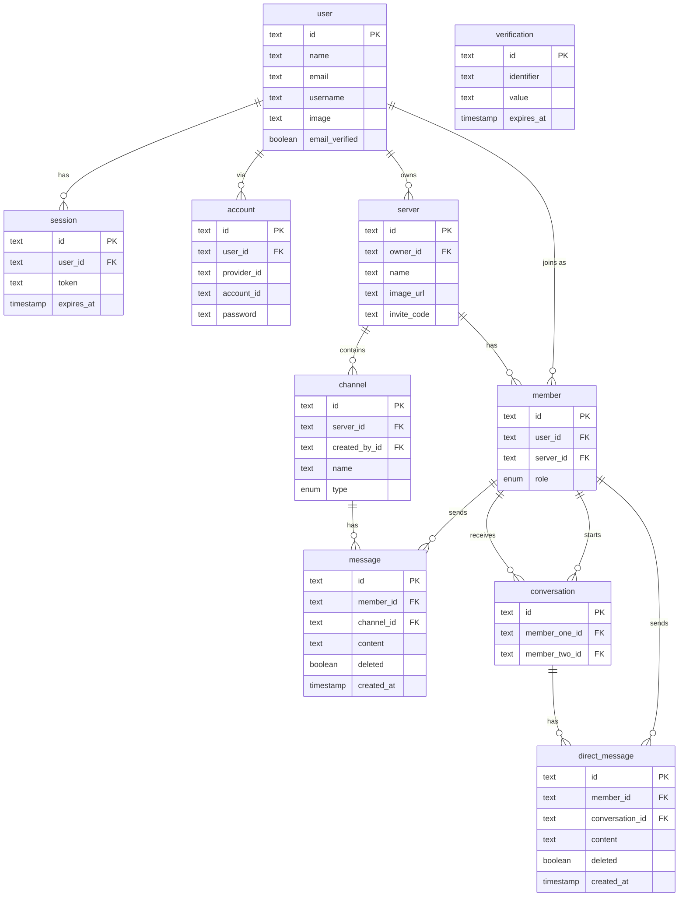

# Banana Space 🍌
Banana Space is a platform for all forms of realti mecommunication in one place. (Chat | Voice | Video)

I'd be easier just to take a look [here](https://bananaspace.vercel.app).

## Tech stack

- **React**
- **Next.js 16.2.6**
- **Tailwindcss**
- **Socket.io**
- **Drizzle**
- **NeonDB**
- **Shadcn/ui**
- **LiveKit**
- **Uploadthing**
- **BetterAuth**
 

### Key Features:

- Real-time messaging using Socket.io
- Send attachments as messages using UploadThing (images, pdfs)
- Delete & Edit messages in real time for all users
- Create Text, Audio and Video call Channels
- 1:1 conversation between members
- 1:1 video calls between members
- Member management (Kick, Role change Guest / Moderator)
- Unique invite link generation & full working invite system
- Infinite loading for messages in batches of 10 (tanstack/query)
- Server creation/customization
- UI using TailwindCSS and ShadcnUI
- Fully responsive UI
- Light / Dark mode
- Websocket fallback: Polling with alerts
- ORM using Drizzle
- Neon database 
- Authentication with BetterAuth

## ERD:

